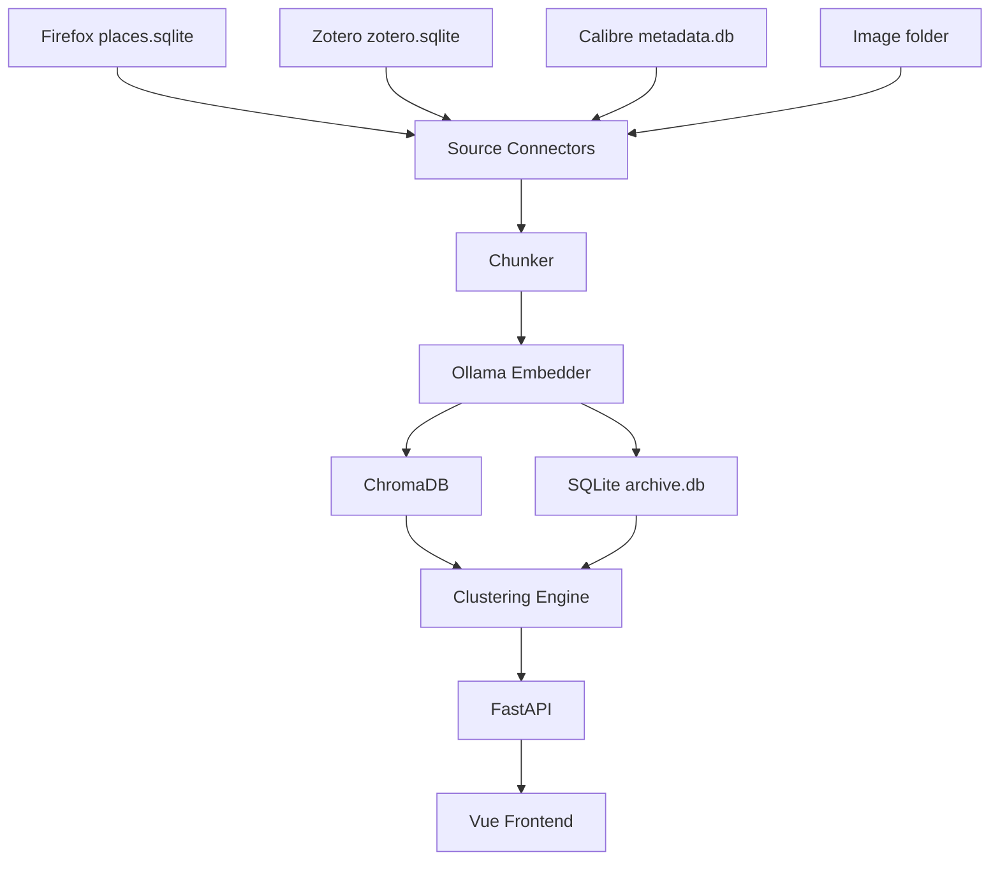

# PKA Design Notes

The authoritative design specification for the Personal Knowledge Archive is
the PDF design document (kept separately by the author). This file holds
supplementary notes accumulated during implementation and the v0.2.0 audit
pass, organised so they can be cross-referenced from the code.

If the PDF is added to the source tree, place it at `docs/design.pdf` and
treat its statements as overriding anything written below.

## 1. Data flow

## 2. Adding a new source connector

To add a new source (e.g. Pocket, Raindrop, Readwise):

1. Create `pka/connectors/<source>.py` exposing a `load_items()` function
   that returns a list of dataclass objects with at minimum the fields
   `source_id`, `title`, `tags`, `date_added`.

2. Add the source to the `Source` enum in `pka/constants.py`.

3. Add `pka/ingestion/runners/<source>.py` with metadata/embed steps routing
   text through `ingest_text_block()` in `pka/ingestion/core.py`.

4. Add `pka/ingestion/<source>_sync.py` with `sync_<source>_metadata` /
   `sync_<source>_ingest` (and optional `sync_<source>` full pipeline).

5. Register handlers in `pka/ingestion/registry.py` (used by the ingestion API).

6. Add `count_pending_metadata()` coverage in `pka/ingestion/pending_metadata.py`
   if the source is document-based.

7. Add `scripts/run_<source>.py` calling the `sync_*` entry points.

8. Add a fixture in `tests/conftest.py` and a test module
   `tests/test_connector_<source>.py`.

9. Add an entry to the sidebar in `frontend/src/components/AppSidebar.vue`.

## 3. Two-phase ingestion model

Calibre and Firefox follow a two-phase pattern:

- **Phase 1** is fast and deterministic. It writes document rows and
  embeds whatever cheap text is immediately available (title + abstract
  for Zotero, title + description for Calibre, bookmark metadata for
  Firefox). Phase 1 is what every routine `python scripts/run_*.py`
  performs.

- **Phase 2** is slow and side-effecting. It pulls full-text from PDFs/EPUBs
  (Calibre) or fetches and extracts HTML and remote PDFs (Firefox) and embeds
  the result.
  Chunk indices are offset past the phase-1 chunks via `existing_chunk_count()`
  so the two passes coexist in a single document.

Phase-2 work is gated behind `--fulltext` (Calibre) or runs through
`pka.ingestion.fetcher.fetch_and_embed_pending()` (Firefox). Each worker
fetches one URL, persists fetch metadata, embeds immediately, then moves on—
extracted text is not batched in RAM. Docs marked `fetched` but missing
chunks are re-queued automatically on the next ingest run. When a Firefox URL
returns HTTP 404, the fetcher can fall back to the closest Internet Archive
snapshot (`fetch_wayback_fallback`, default on).

## 4. Cluster lifecycle

Every clustering run is stored regardless of acceptance. The UI surfaces
runs through `/runs` and lets the operator accept exactly one as the active
run. Drift detection (`compute_drift`) and merge suggestions
(`compute_merge_suggestions`) operate against the active run and flag
clusters that may need to be split or merged, but never act automatically.

Clustering uses **hierarchical HDBSCAN**: a global pass produces level-1
clusters; each sufficiently large L1 cluster gets a local UMAP+HDBSCAN pass
for level-2 sub-clusters. Manual “apply tag” writes `overlay_tags` with
origins `cluster_l1` or `cluster_l2` for browse filtering.
