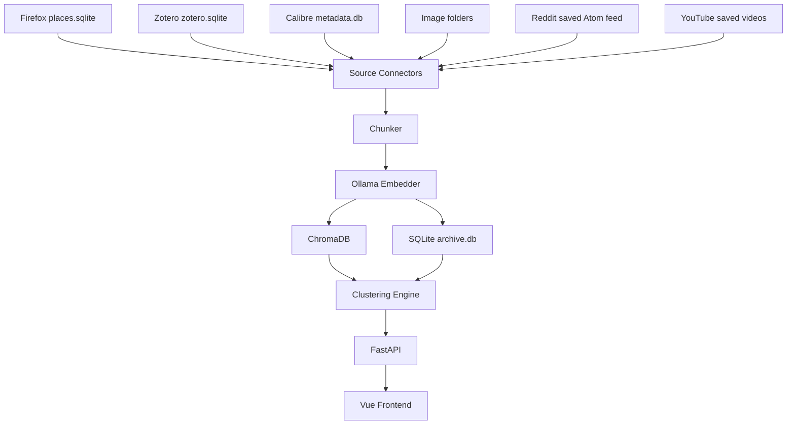
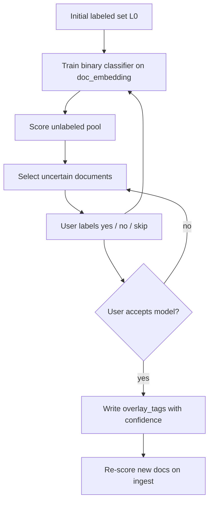

# Alexandria Design Notes

This file is the living design specification for Alexandria: notes
accumulated during implementation and the v0.2.0 audit pass, organised so they
can be cross-referenced from the code.

The original design document, `docs/archive/initial_design.pdf` (March 2026),
records the project's initial intent and is **superseded wherever it disagrees
with this file** — most visibly on the local-only stance (see §1.1) and on the
set of source connectors.

## 1. Data flow



The graph above collapses all six sources into one `Source Connectors` box.
[`docs/ingestion-flows.md`](docs/ingestion-flows.md) expands that box: one
mermaid flow graph per source, colour-coded so shared machinery, source-specific
code, outbound calls, persistence, and flag-gated steps are told apart at a
glance, plus a matrix of which shared component each pipeline actually uses.

Those graphs are **derived from the code**, not a second specification — this
file and `pka/` both outrank them. They are also not automatically checked, so
a change to the phase shape, the shared/source-specific boundary, or the set of
gated outbound calls must redraw them in the same commit (see `CLAUDE.md`).

### Model backends (providers)

Every LLM / vision / OCR / image-embedding call goes through a swappable
**provider** in `pka/providers/` rather than talking to a backend directly.
Selection is **per-capability** via config, so remote chat can run alongside
local OCR/embeddings:

| Capability | Config setting | Backends | Interface (`pka/providers/base.py`) |
|-----------|----------------|----------|-------------------------------------|
| Chat (text→JSON) | `chat_provider` | ollama, ollama_cloud, openrouter, ovh, scaleway | `ChatProvider` |
| Vision (image→text) | `vision_provider` | ollama, ollama_cloud, openrouter, ovh, scaleway | `VisionProvider` |
| OCR (image→text) | `ocr_provider` | vlm, easyocr | `OcrProvider` |
| Image embed (CLIP) | `image_embed_provider` | clip | `ImageEmbedder` |

The image-embed capability is additionally gated by `clip_enabled` (default
**off**) — see §3.3; the other three always run.

OpenRouter, OVH, and Scaleway share one OpenAI-compatible implementation
(`openai_compat.py`); credentials/models come from `ALEXANDRIA_OPENROUTER_*` /
`ALEXANDRIA_OVH_*` / `ALEXANDRIA_SCALEWAY_*`.

`ollama` and `ollama_cloud` likewise share `ollama.py`, because Ollama Cloud
serves the same native `/api/chat`; the cloud form is the same classes built
with `remote=True` plus `ALEXANDRIA_OLLAMA_CLOUD_*` (host, Bearer key, model).
`remote=True` also switches off the local niceties that would be wrong against a
hosted endpoint: no `/api/tags` model auto-detection and no fallback to
`chat_model`/`vision_model`, so a local model name can never be sent to the
cloud, and a missing key or model is reported rather than guessed. Cloud models
can alternatively be reached with `chat_provider=ollama` by pointing
`chat_model` at a `:cloud`-tagged model, which the signed-in local daemon
proxies — that route needs no `ollama_cloud` settings at all.

Callers use the accessors in `pka/providers/__init__.py`
(`get_chat_provider()` etc.); the historical `pka.ollama_chat.chat_json` and
`image_extractor.classify_and_describe` / `ocr_image` / `clip_embed_*` are thin
shims over these. **Text-chunk** embeddings are intentionally *not* here — they
stay inside ChromaDB's built-in function (see `pka/storage/vector_store.py`).

### 1.1 Network access policy

Alexandria was originally specified as local-only. That has been **relaxed**:
the primary development machine cannot run models large enough for several of
the tasks the design calls for (long-document summarisation, reliable vision
extraction), and capping every capability at what the local hardware fits held
output quality below the point of usefulness. Local-only is therefore a
*default*, not a constraint.

The rules that replace it:

- **Local by default.** A fresh checkout with no `.env` performs no network
  calls except to `localhost` (Ollama). Every outbound path is a named setting
  that defaults to off.
- **No implicit escalation.** Enabling one outbound path never enables another.
  Where a feature has a primary and a fallback route (e.g. identifier lookup vs.
  web search), each gets its own flag and the fallback additionally requires the
  primary's flag.
- **Telemetry stays prohibited**, in every configuration. Relaxing local-first
  covers work the user asks for; it does not cover the project reporting on its
  users. `anonymized_telemetry=False` is set on every Chroma client.
- **Credentials live in `.secrets`** (`SECRET_`-prefixed), never in `.env`, and
  never in the repository.

What actually crosses the wire differs by category, and the distinction matters
more than the on/off state:

| Category | Settings | What is sent |
|---|---|---|
| Inference providers | `chat_provider`, `vision_provider`, `image_gate_vision_provider`, `ocr_provider` | **Document content** — chunk text, or image bytes. The largest exposure; a hosted provider sees the material itself. |
| Enrichment lookups | `external_lookup_enabled`, `cover_search_fallback`, `doi_metadata_lookup` | **Derived identifiers** — an ISBN, a title+author string, or a DOI derived from a bookmarked publisher URL. Reveals *library inventory* (what is on the shelf) rather than content. |
| Source connectors | `ALEXANDRIA_YOUTUBE_*`, `ALEXANDRIA_REDDIT_*` (OAuth credentials or `reddit_feed_url`), Firefox phase-2 fetch | **Nothing new** — these read back your own data from a service you already gave it to, or fetch a URL you bookmarked. |

Text-chunk embeddings are the one capability with no remote option: they stay
inside ChromaDB's built-in function, so the embedding of every document is
computed locally regardless of configuration.

The outbound flags above are surfaced read-only in the UI at `/settings`
(`pka/api/settings_view.py`), alongside every other config field and a
per-capability reachability check. That page follows the same policy it
reports on: the local Ollama backend is probed on mount because
`ollama_base_url` defaults to `localhost` (reusing the existing
`OllamaChatProvider.resolve_model` auto-detect probe), while every remote
backend is probed only when the user clicks *Check* — a page load must not
itself become a new outbound call.

## 2. Adding a new source connector

To add a new source (e.g. Pocket, Raindrop, Readwise):

1. Create `pka/connectors/<source>.py` exposing a `load_items()` function
   that returns a list of dataclass objects with at minimum the fields
   `source_id`, `title`, `tags`, `date_added`.

2. Add the source to the `Source` enum in `pka/constants.py`.

3. Add `pka/ingestion/runners/<source>.py` with metadata/embed steps routing
   text through `ingest_text_block()` in `pka/ingestion/core.py`.

4. Add `pka/ingestion/<source>_sync.py` with `sync_<source>_metadata` /
   `sync_<source>_ingest` (and optional `sync_<source>` full pipeline).

5. Register handlers in `pka/ingestion/registry.py` (used by the ingestion API).

6. Add `count_pending_metadata()` coverage in `pka/ingestion/pending_metadata.py`
   if the source is document-based.

7. Add `scripts/run_<source>.py` calling the `sync_*` entry points.

8. Add a fixture in `tests/conftest.py` and a test module
   `tests/test_connector_<source>.py`.

9. Add an entry to the sidebar in `frontend/src/components/AppSidebar.vue`.

### 2.1 YouTube saved-videos connector (network source)

The YouTube connector (`Source.YOUTUBE`) reaches an external API rather than a
local file, as does Reddit (§3). Both predate the §1.1 policy and both already
satisfy it. The properties below are the shape any network connector should
have — a template to copy, not an exception to be argued down:

- **Inert by default.** Nothing happens unless the user configures a desktop-app
  OAuth client secret (`ALEXANDRIA_YOUTUBE_CLIENT_SECRET`). No credentials → the
  source reports "unavailable" and every status poll stays network-free
  (`count_pending_metadata` / `source_corpus_size` return 0 for YouTube; the real
  pending count is computed inline from the loaded videos in
  `sync_youtube_metadata`).
- **Read-only, local token.** Scope is `youtube.readonly`; the OAuth refresh
  token is cached at `data/youtube_token.json` (git-ignored) and never leaves the
  machine. No telemetry, no writes back to YouTube.
- **Optional dependency.** `google-api-python-client` / `google-auth-oauthlib`
  live in the `youtube` extra and are lazy-imported inside the auth helpers, so
  `pka.connectors.youtube` imports (and unit-tests, via an injected fake
  `service`) without them installed.
- **Metadata only.** `load_saved_videos()` lists the Liked-videos playlist plus
  all owned playlists, dedupes videos across playlists (playlists → source
  collections, earliest add time → `date_added`), and hydrates title/channel/
  description/tags via `videos.list`. Embed text is
  `title + channel + description + tags`. Note: the Data API no longer exposes
  *Watch Later*, so it is not included. Transcript enrichment is deferred
  (`planning/BACKLOG.md`).

Otherwise the connector follows the standard §2 checklist and the Zotero-style
two-phase flow (metadata import, then embed — no async fetch phase).

## 3. Two-phase ingestion model

> Drawn per source in [`docs/ingestion-flows.md`](docs/ingestion-flows.md),
> including where each pipeline departs from the pattern below — Firefox
> interleaving phase 2 with its fetch, Calibre running the embedding phase
> twice, Reddit forking on `external_url`, and Images substituting four
> extraction passes for a fetch. Keep those graphs in step with this section.

Calibre and Firefox follow a two-phase pattern:

- **Phase 1** is fast and deterministic. It writes document rows and
  embeds whatever cheap text is immediately available (title + abstract
  for Zotero, title + description for Calibre, bookmark metadata for
  Firefox). Phase 1 is what every routine `python scripts/run_*.py`
  performs.

- **Phase 2** is slow and side-effecting. It pulls full-text from PDFs/EPUBs
  (Calibre) or fetches and extracts HTML and remote PDFs (Firefox) and embeds
  the result.
  Chunk indices are offset past the phase-1 chunks via `existing_chunk_count()`
  so the two passes coexist in a single document.

Phase-2 work is gated behind `--fulltext` (Calibre) or runs through
`pka.ingestion.fetcher.fetch_and_embed_pending()` (Firefox). Each worker
fetches one URL, persists fetch metadata, embeds immediately, then moves on—
extracted text is not batched in RAM. Docs marked `fetched` but missing
chunks are re-queued automatically on the next ingest run. When a Firefox URL
returns HTTP 404, the fetcher can fall back to the closest Internet Archive
snapshot (`fetch_wayback_fallback`, default on).

**Publisher URLs are resolved by identifier, not scraped.** A bookmark on
`nature.com`, `link.springer.com`, `journals.aps.org`, `sciencedirect.com` or
`doi.org` carries a DOI (or an Elsevier PII), and `mitpress.mit.edu` carries an
ISBN, so the handlers in `pka/ingestion/` look the identifier up instead of
fetching a page that is either a `403` or a paywall served at HTTP 200. A
`doi.org` bookmark resolves against `doi.org` itself, which is the host the user
bookmarked, so it needs no flag; the others reach `api.crossref.org` (and
Semantic Scholar when the record carries no abstract) and are gated on
`doi_metadata_lookup`, default **on** — the wire carries one DOI to a
non-commercial registry, and with the flag off those handlers degrade to a
URL-derived card rather than to the paywall scrape. `mitpress.mit.edu` rides the
existing `external_lookup_enabled` (default off) since its lookup is Open
Library by ISBN, and `researchgate.net` — hard-blocked, no public API — builds
its card from the URL slug with no request at all. `direct.mit.edu` is blocked
too and uses whichever of the two applies: a Crossref citation query for an
article (`doi_metadata_lookup`), an Open Library title lookup for a book
(`external_lookup_enabled`). No flag enables another.

**PDF extraction reports why it found nothing.** `extract_pdf_report`
(`book_extractor.py`) returns sections *plus* a `PdfTextLayer` verdict, because an
empty result has four causes that deserve different handling: a scan
(`no_text_layer`), a file neither pdfplumber nor pypdf can open (`unreadable`), a
document with no pages (`empty`), and a page cap that stopped before any text
appeared (`unknown` — with `fetch_pdf_max_pages` at 3, a scanned cover in front of
a text body reads exactly like a scan, so no verdict is reached). Only the first
is worth OCR and only the first is recorded, as `fetch_status = no_text_layer` on
both the Calibre and the fetch route. Nothing re-queues that state: re-reading the
same bytes cannot produce text. It exists so that "not extracted yet" and "has
nothing to extract" stop looking identical from the database, and it is the work
queue the OCR entry in `planning/BACKLOG.md` would consume.

**Page ranges travel with the chunk.** A PDF section is a group of ten
*text-bearing* pages labelled with its real 1-based page numbers — a page with no
text layer no longer shifts the numbering of the pages after it — and every chunk
cut from that section carries its `page_start` / `page_end` into both the Chroma
metadata and the `chunks` table, so a retrieved passage can be cited back to the
pages it was read from. The section is the finest unit available: the chunker
receives it as one block, so per-chunk page attribution would need
`sentence_window_chunks` to return a sentence→page map. The fetch route drops the
range — it embeds a fetched document as a single block and has nowhere to hang it.

**Reddit saved posts** are a *network* source (no filesystem path) rather than a
local DB, with **one loader** producing `RedditSaved`:

1. **Private feed** (`reddit_feed_url`) — the token-bearing feed Reddit issues
   from `/prefs/feeds/`. Preferred when set: registering a "script" app now
   requires a separate API-access clearance that personal accounts do not get by
   default (the create form simply re-renders), whereas the feed URL is handed
   over on a preferences page. `load_saved_from_rss` fetches exactly **one
   endpoint**, `saved.rss` — the Atom form feed readers use.

   `saved.json`, the richer listing payload, is deliberately **not requested**.
   Automated clients get a 403 whose body is the web app's HTML: the request
   never reaches the feed's token auth, so it cannot be fixed by rotating the
   token, and it never once succeeded in practice. It used to be tried first
   with the Atom feed as fallback, which meant every sync opened with a blocked
   request against an account Reddit is already scrutinising — the cost of
   looking like a scraper, for a payload that never arrives. `_feed_url` now
   normalises a pasted `.json` URL to `.rss` rather than honouring it; the token
   is the same either way.

   Atom is thinner than the listing would be: no `is_self`, so a self-post and a
   link post are told apart only by the anchor Reddit labels `[link]`; and no
   `after` field. The cursor is *derived* instead — each entry's `<id>` is the
   fullname `after` expects, so the last entry of a page pages the next. The
   body arrives inline (`<content type="html">`), so self-posts and comments owe
   no fetch, and `limit` is honoured; without it Reddit serves 25, so the loader
   always asks for the 100-item maximum. Roughly 1000 items is where Reddit
   stops paging, which covers a recent history but not the far end of an old
   saved list.

   Failing pages are guarded against a server that ignores `after`: a page
   contributing no new fullnames ends the walk. The URL *is* the credential, so
   it lives in `.secrets`, is redacted (`_redact`) in every error, and the
   `httpx` logger is quietened for the duration of the request — httpx logs the
   full URL at INFO, which would otherwise print the token.

   **Two walk modes.** `sync_reddit_metadata` is incremental by default: it
   passes the archive's existing fullnames (`document_index`, already computed
   for the pending count) and the walk stops at the *first* one it recognises,
   mid-page. That is correct because the listing is ordered by **save** time,
   newest first — everything past a known item was saved earlier and is already
   held. Note the stop signal is deliberately fullnames rather than dates:
   Atom's `<updated>` is when an item was *created*, so an old post saved today
   sorts first while carrying an old timestamp, and a date cutoff would end the
   walk on precisely the item that is new. `backfill=True` (`alexandria reddit
   --backfill`) disables the early stop and walks the whole feed, for a first
   run or to fill gaps a failed run left behind.

   The ingest phase needs a body for every item still missing chunks, not just
   the newest saves — but it reads that back from SQLite (`all_reddit_items`)
   rather than walking the feed again: the metadata phase already persists
   kind/subreddit/permalink/external_url/body for every item it sees, new or
   already known, so a second live poll bought nothing but doubled the request
   count against Reddit's API. This also means the ingest phase sees the full
   history the archive has ever recorded, not just what the feed's ~1000-item
   window still serves.

   **Throttle.** `_throttle_poll` sleeps `reddit_feed_poll_interval_seconds`
   (default 1.0) plus up to `reddit_feed_poll_jitter_seconds` (0.5) *between*
   pages, never before the first request — so an incremental sync that finishes
   in one page never sleeps. Only a backfill issues requests in a row, and a
   fixed-rate burst is what bot protection is built to notice; the jitter keeps
   a repeating loop from settling into a metronome.

   **Every poll is archived** (`pka/connectors/reddit_archive.py`,
   `reddit_archive_enabled`, default **on** — a local disk write, not an
   outbound path). Reddit is the only source with no local original: Firefox,
   Zotero and Calibre keep their own databases, whereas the saved list lives on
   a server behind a token that can be rotated, a bot filter that can start
   refusing us, and a feed that serves only the newest slice. A poll is in
   practice unrepeatable, so it is written down before it is parsed:

   ```
   data/reddit/
     20260819T140322Z/     # one poll
       page-01.xml         # the Atom document exactly as served
       manifest.json       # when, page count, item ids, new/changed/unchanged
     saved.jsonl           # cumulative, deduplicated item log
   ```

   Two layers because they answer different questions. The timestamped
   directories are *evidence* — byte-identical pages, never revisited, which is
   what you want when asking what changed since last week or why the parser
   produced a given field. `saved.jsonl` is the *restore path*: one line per
   item, appended only when that item is new or its content actually changed,
   so re-running an unchanged backfill appends nothing while an edited comment
   still appends a new record and wins on read (last record per id).
   Deduplication is by content digest rather than by id alone — an id-only rule
   would silently drop edits.

   The archive is written from a `finally`, so a walk that dies on page 3 keeps
   pages 1–2 and records the failure in its manifest; that is precisely when the
   bytes are worth having. Nothing in it may break a sync: every write is
   best-effort and reports failure through the log. The feed URL never reaches
   it — only response bodies are written, and manifests carry no URL.

   `load_saved_from_archive` reads `saved.jsonl` back as `RedditSaved` with no
   network at all; `alexandria reddit --from-archive` (any phase) runs the
   pipeline off it, which is how a rebuilt database is refilled once the token
   stops working.
2. **PRAW** (the OAuth API) — **removed**. It was the original route, but
   creating the "script" app it requires now needs an API-access clearance a
   personal account does not get, so the code could not be exercised at all:
   dead credentials (5 settings), a dead optional dependency, and a test suite
   for a path that never runs. `git log` has it if Reddit reopens that door.
   `load_saved` is now the feed loader itself, and `reddit_feed_url` is the
   connector's only credential — unset, it raises rather than falling back.

Phase 1
persists every saved item; phase 2 embeds the inline body of self-posts and
comments (the cheap text) and fetches external link posts through the shared
fetcher (`fetch_and_embed_pending(source=Source.REDDIT)`, backed by the
generalized `source_ingest_queue`). Because probing the API on every status poll
would be slow and rate-limited, `count_pending_metadata` / `source_corpus_size`
return 0 for Reddit and the metadata sync computes its own pending count from the
freshly loaded saved list.

Phase 1 also writes a `reddit_items` row per document (same 1:1 shape as
`images`), holding the fields `documents` cannot: the post/comment **body**
verbatim — `card_summary` is a 280-char card excerpt and the chunks are
overlapped and whitespace-normalised, so neither reconstructs what the user
saved — and the **permalink**, which a link post's `url_or_path` displaces with
its external target. The detail API (`/documents/{id}` → `reddit`) serves these,
falling back to values recovered from `item_type`, `source_collections`, and the
fullname when a library predates the table; the body alone has no fallback, and
appears once the next metadata run backfills it. Because that backfill is the
point, the Reddit metadata loop runs `persist` for already-archived items too
(`skip_when_in_known=False`) while still reporting them as skipped.

Firefox phase 2 also uses domain-specific handlers instead of raw HTML scrape
where APIs exist: Wikipedia (MediaWiki), Amazon product pages, **arXiv**
(`export.arxiv.org` metadata + PDF — updates `documents.title` and
`documents.card_summary` from the abstract), and **bioRxiv** (`api.biorxiv.org`
DOI lookup + PDF, same card fields).

### 3.1 Image admission gate

Before an image runs the expensive describe / OCR / CLIP passes, `ingest_image`
runs a two-step gate (`pka/ingestion/image_gate.py`), on by default
(`image_gate_enabled`). Both steps must pass:

1. **Text coverage** — `EasyOcrProvider.text_coverage()` detects text boxes and
   sums their area; the fraction of the image covered must be ≥
   `image_gate_text_coverage_min` (default `0.05`). This runs first because it
   is cheap and local; the VLM is only called when it passes. The gate uses
   EasyOCR **directly**, independent of `ocr_provider` (which may be the VLM
   backend), so `easyocr` — a core dependency — is required whenever the gate is
   enabled.

2. **Category of interest** — a *distinct*, deliberately small/fast VLM
   (`image_gate_vision_provider` / `image_gate_vision_model`, default Ollama
   `moondream`) classifies the image; anything landing on `unknown` is rejected.
   Since §3.2 landed, this label is **no longer only a filter**: it also selects
   the per-type content prompt, and `images.image_type` plus the
   `TagOrigin.INFERRED` overlay tag are taken from it rather than from a second
   classification by `vision_model`. That is what makes the better prompt free —
   re-classifying with the main model would cost the extra call the design exists
   to avoid. The trade is real and worth knowing: with the gate **on**, the
   user-visible image type comes from the small gate model; with the gate **off**
   (or `--skip-gate`), the pipeline classifies with `vision_model` as before.

Failing either step records the path in the **`image_rejections`** table
(`record_image_rejection`, upsert by path) with the reason
(`low_text_coverage` | `not_category_of_interest`), then **drops any rows a
prior metadata pass registered** for that path (`delete_image_document` removes
the `images` sidecar + backing `documents` row, and purges chunk/CLIP vectors if
the image had been fully ingested before). So a rejected image leaves nothing
behind. On later runs both `register_images` and `ingest_images` load
`get_rejected_paths()` and skip cached rejections — metadata sync won't
re-register them and ingest won't re-gate them. `--skip-gate` (CLI) or
`ALEXANDRIA_IMAGE_GATE_ENABLED=0` bypasses the gate entirely; `dry_run` reports
the rejection without caching or deleting.

**Deferred display.** Images are registered (a `documents` + `images` row with
`indexed_at IS NULL`) during the fast metadata phase, but the describe/OCR/CLIP
work and the gate run in the later ingest phase. To avoid showing half-processed
images, both browse surfaces hide images until `indexed_at` is set: the document
browse list (`list_documents` via `_exclude_pending_images`) and the `/images`
gallery (`indexed_at IS NOT NULL`). A pending image appears only once its embed
pass completes (or disappears entirely if the gate rejects it).

### 3.2 Retrieval enrichment

What reaches the vector index is uneven across sources, and the gaps are
systematic rather than incidental:

- **Firefox / Reddit link posts** embed fetched body text *only* — no title, no
  URL, no `card_summary` (which is computed and then used solely for the browse
  card). With the 80-char `min_chunk_chars` floor and no `fallback_text`, a thin
  page yields **zero chunks**, hence no `doc_embedding`, hence no cluster
  membership and no learned tags.
- **Calibre full text** produces hundreds of body chunks, none of which states
  what the book is about. Because `/search` collapses to the best-matching chunk
  per document, a book can never accumulate score from many weak chunks, so
  document-level queries ("book about X") have nothing to match.
- **Images** embed `description + ocr_text`, where the description came from a
  prompt asking what the image *looks like*. For a whiteboard that yields "a
  whiteboard with diagrams"; for a book cover, the jacket art. Near-zero
  retrieval value against the reason the photo was taken.

Three mechanisms close these, in ascending cost:

1. **Deterministic** — embed the title and the existing `card_summary`. No
   inference, no network, no flag. Also supplies `fallback_text` so a document
   can no longer end up with zero chunks.
2. **Local VLM prompting** — replace the single generic image prompt with
   per-type prompts keyed on the category the gate already resolved
   (§3.1): a *transcript* for `slide` / `notes` / `whiteboard`, a *content*
   summary for `poster`, and structured `{title, authors, isbn}` extraction for
   `book_cover`. The gate already calls `classify_and_describe` and discards its
   description, so the type is known before the main pass — a per-type content
   prompt costs no extra call, it spends the existing one better. Falls back to
   classify-then-prompt (two calls) when the gate is disabled or `--skip-gate`.
3. **External lookup / summarisation** — see the table below. All default-off
   per §1.1.

| Document type | Enrichment | Default |
|---|---|---|
| Firefox bookmark, Reddit link post | Title + `card_summary` embedded | **on** |
| " | Local LLM summary chunk, `pass="summary"`, cached in `documents.generated_summary` and stamped with the run that made it | off (`bookmark_summary_enabled`) |
| Reddit self-post, Reddit comment | Same summary chunk over the inline body. Framed per `material` (`_MATERIALS` in `summarize.py`) so a comment is not summarised as a document, with the thread title passed as `context` — a comment lifted out of its thread often names none of its own subject | off (`bookmark_summary_enabled`) |
| Image `book_cover` | ISBN → Open Library → second catalogue; one chunk per visible book | off (`external_lookup_enabled`, `cover_search_fallback`) |
| Image `poster` | VLM content summary | **on** |
| Image `slide`, `notes`, `whiteboard` | VLM transcript | **on** |
| Calibre, ISBN present | Open Library by ISBN | off (`external_lookup_enabled`) |
| Calibre, no ISBN | Title/author lookup → second catalogue. Skipped entirely when Calibre already holds a description, since pass 1 embeds that | off (`external_lookup_enabled`) |
| Calibre full text | Local map-reduce summary over the extracted sections | off (`book_summary_enabled`) |
| Long fetched articles | Same path as bookmarks — they are the same runner | off (`bookmark_summary_enabled`) |
| Zotero | *No summary* — the abstract already is one. The real gap is that attached PDFs are never ingested (`planning/TODO.md`). | — |
| YouTube | *No summary* — nothing to summarise beyond uploader metadata. Transcripts (`planning/BACKLOG.md`). | — |

**Structured bibliographic fields.** `documents` also carries `doi`, `arxiv_id`,
`isbn`, `year`, `authors_json`, `zotero_url`, `zotero_path` — nullable columns,
populated by whichever source has the data (Zotero: doi/arxiv_id/year/authors;
Calibre: isbn/year/authors; arXiv/bioRxiv fetch: doi/arxiv_id/authors). No
per-source sidecar table: these fields are cross-source (DOI spans Zotero and
bioRxiv, authors span all four), so a sidecar like `reddit_items` would solve
one source and leave the others stranded, and a cross-source dedup pass would
have to union across sidecars that do not all exist. `doi`/`arxiv_id`/`isbn` are
indexed as join keys for `planning/TODO.md`'s *Deduplication of items*; an arXiv
document with no source DOI derives one (`10.48550/arXiv.<id>`) so preprints are
not a hole in that join. See `planning/archive/DOCUMENT_METADATA_PLAN.md`.

**Resolution ladder.** Covers and no-ISBN Calibre books share one cascade:
checksum-validated ISBN → Open Library by title+author with the canonical result
round-tripped against what was extracted → **a second catalogue** for books Open
Library does not hold (self-published work, foreign editions, theses). That third
rung is Google Books by default: documented, free, and keyless, so a default-off
feature is switch-on-and-try rather than switch-on-and-register. A general web
search engine was the original plan and is the worse tool for it — it answers
"what is this book about" with retailer and review pages that must then be
scraped and trusted, where a catalogue answers directly with canonical title and
author fields the same round-trip check can verify. `pka/ingestion/book_search.py`
keeps the rung behind a provider registry, and `search_provider` is a
comma-separated **chain** rather than a single choice, so a weaker backend runs
*after* a stronger one instead of replacing it: `google_books,brave` consults the
catalogue first and falls to web snippets only when it misses. Brave and Staan
ship as web-search providers alongside Google Books; both need a key, return a
search snippet rather than a curated synopsis, and can only verify
one-directionally (the extracted title must appear in the page title, since a
search engine has no canonical title field), which is why they belong last in a
chain. Listing a backend whose key is absent is harmless — that rung skips
rather than erroring. The query is always a pure function of `(title, authors)`,
never a model-authored string, so results are cacheable by that key and the
whole ladder is replayable without re-running the VLM. An empty title is a clean
stop condition: no identifier, no query, record the reason.

The governing principle: **the more identifiable a document, the better an
external lookup serves it; the more unique, the more it needs local inference.**
`slide` / `notes` / `whiteboard` sit at the far end — they depict the user's own
thinking and have no external identity, so prompting is the only lever.

**Guardrails.** Enrichment text is added as its own chunk tagged
`pass="external_synopsis"` or `pass="summary"` (mirroring Calibre's existing
`pass=metadata` / `pass=fulltext`), carrying the resolved identity where one
exists. It never overwrites `images.description` or `card_summary`, so the
browse card stays truthful about the artifact itself, and a bad batch is
purgeable and auditable without re-ingesting. CLIP vectors are untouched —
they are visual, and a synopsis has no business in them. Generated summaries are
cached in a column so purge-and-reingest does not re-run inference, and are kept
to 2–4 sentences because MiniLM truncates in the low hundreds of word-pieces.
A multi-book cover attaches one chunk per book; note that a shelf photo with a
dozen synopses will dominate that document's mean-pooled `doc_embedding`.

**Provenance.** An enrichment artifact records what made it. `enrichment_runs`
(`pka/enrichment_runs.py`) holds one row per *pass* — a source sync, or an
explicit re-summarise — carrying the provider, the **resolved** model name, the
parameters the pass ran with, and what it cost in provider calls and characters
sent. `documents.summary_run_id` points at it.

This is what makes a backend swap survivable. Purging is otherwise all-or-
nothing: "clear the summaries the old model made and keep the ones I still
want" is not merely awkward without a stamp, it is unexpressible, so the only
available button throws away the work you are keeping along with the work you
are replacing. With the stamp, a purge takes a `run_id`, a `provider`/`model`,
or `unknown`.

Three properties are load-bearing:

- **The model recorded is the resolved one**, not the configured one. `chat_model`
  defaults to `""`, meaning "auto-detect the first non-embedding model from
  `/api/tags`", so the config value would record nothing useful on the most
  common local setup.
- **`NULL` means genuinely unknown**, and is never backfilled. Every artifact made
  before stamping shipped has unknown provenance; "made by whatever is configured
  now" is exactly the guess a provenance-filtered purge would then act on.
- **A target with no stamp refuses a provenance filter** rather than ignoring it.
  Answering "purge what the old model made" by purging everything is the failure
  mode this exists to prevent.

Only summaries are stamped today. The same shape extends to image descriptions,
OCR and book extraction when those are wired (`planning/PURGE_AND_PROVENANCE_PLAN.md`
§6.2). This deliberately generalises `cluster_runs`, which already worked this
way, and it is not a job history: live job state stays in `pka/ingestion/progress/`.

### 3.3 Image search paths (CLIP is opt-in)

A text query reaches an image two independent ways, and they are worth keeping
distinct because they fail differently:

| Path | Function | Space | Matches |
|------|----------|-------|---------|
| Visual | `search_images_by_text` | CLIP (`alexandria_clip`) | the query against the **picture** |
| Inferred text | `search_images_by_inferred_text` | MiniLM (`alexandria_chunks`) | the query against the text read **out of** the picture |

The second path needs nothing image-specific: §3.2's per-type content
extraction, the description, and OCR are already assembled by
`image_search_text` and written as ordinary chunks with `source=image`, so a
filtered query over the shared collection *is* an image search. It collapses
chunks to the best one per document — a shelf photo with a transcript chunk and
several synopsis chunks is one result, not five.

**CLIP is therefore opt-in** (`clip_enabled`, default off). It buys exactly one
thing the other path cannot: matching a query whose words appear nowhere in the
inferred text — a photo of a red bicycle found by "bicycle" when the VLM wrote
"a bike leaning on a wall". That is a real capability and a narrow slice of real
queries, and it costs a ~600 MB model download, a fourth pass per image, and a
second Chroma collection to maintain and purge. Off by default, paid for
deliberately.

The switch is enforced in two places only. Ingestion: `image_sync` and the CLI
pass `skip_clip=not clip_enabled`, so no vectors are written (`ingest_image`
keeps its own `skip_clip` argument — the flag is applied by callers, exactly as
`ocr_enabled` is). Query: `search_images_by_text` returns `[]` before touching
the model, so `/search`, `/images/search` and `alexandria images --search`
inherit the gate without a flag check of their own, and nothing loads CLIP to
query vectors that were never written.

Consumers differ in how much of this they see. `/search` folds CLIP hits into
the unified document list and needs no second path — its semantic branch already
queries the collection the image chunks live in, so images surface there whether
or not CLIP ran. `/images/search` returns images, not documents, so it runs both
paths itself (`mode=hybrid|clip|text`, default hybrid) and merges them by best
similarity, tagging each hit with `matched_by` (`clip`, `text`, or `clip+text`).
That merge compares scores from two embedding spaces, which is an approximation
— the same one `/search` already makes — and it decides ordering only: both
paths return their results either way.

## 4. Cluster lifecycle

Every clustering run is stored regardless of acceptance. The UI surfaces
runs through `/runs` and lets the operator accept exactly one as the active
run. Drift detection (`compute_drift`) and merge suggestions
(`compute_merge_suggestions`) operate against the active run and flag
clusters that may need to be split or merged, but never act automatically.

When an ingest or full sync finishes cleanly and a run is accepted,
`assign_new_docs` files the newly chunked documents into that run's existing
clusters by nearest centroid, so the archive stays browsable between runs. That
assignment is the only automatic clustering step: it adds documents to clusters
that already exist and never creates, relabels, or re-clusters a run. Producing
a new run stays an explicit action (`/runs/trigger`).

Clustering is two-level hierarchical, over a selectable clusterer. The default
is **HDBSCAN** (PCA space): density-based, so it leaves low-density documents as
noise (label `-1`) rather than forcing them into a cluster. A run that produces
any noise gets exactly one **noise bucket** — a real `clusters` row
(`is_noise=True`, no centroid, label "Unclustered") that every noise document is
assigned to, instead of being left with no `cluster_assignments` row at all.
This matters for `assign_new_docs`: without a row, a noise document reads as
merely "unassigned" and gets forced into the nearest real cluster on the very
next ingest — exactly what HDBSCAN's noise call was avoiding. With the bucket,
`assign_new_docs` leaves it alone (it already has an assignment), and a
`cluster_assign_min_similarity` floor (default `0.0`, off) applies the same
rule going forward to newly-ingested documents that don't clear it either. The
bucket is excluded from centroid computation, LLM labelling, tagging, and the
cluster explorer's size ordering — it is a holding pen, not a topic.
**Agglomerative** (ward/average/complete/single, `pka/clustering/engine.py`'s
`cluster_space=agglomerative`) is the alternative: it partitions every document
— no noise, so no bucket — and picks its L1 cluster count either explicitly, by
a distance cut, or by an automatic silhouette sweep over one prebuilt
dendrogram; L2 then cuts that same tree deeper inside each L1 group rather than
reclustering, so an L2 agglomerative cluster is by construction a subset of
exactly one L1 cluster. Neither is a strict improvement over the other —
HDBSCAN's noise is an honest signal that a document has no good neighbourhood,
while agglomerative's forced full coverage can dilute a cluster with documents
that do not really belong. Both are run options to compare via `/runs`
acceptance, not a default and a deprecated path. See
`planning/archive/AGGLOMERATIVE_CLUSTERING.md` for the design.

Level-2 subclusters are labelled via LLM from document titles plus content
excerpts (`card_summary` or first chunk); level-1 labels summarize L2 child
labels when subclusters exist, otherwise the same title+content sampling. The
cluster explorer lets you edit labels inline, regenerate via LLM, and apply the
stored label as an overlay tag (`cluster_l1` / `cluster_l2` origins) for browse
filtering.

`run_clustering()`'s parameters (method, min cluster size / samples /
neighbours, min distance, PCA/UMAP dims, linkage, cluster count or distance
threshold, labelling mode) are settable from the UI via a dialog in front of
`/runs`' `+ New run`, not just from the CLI.

## 5. Active learning tag training

**Status:** implemented on branch `active-learning-tags` (backend + v1 UI).

Alexandria already has several tagging mechanisms that do not overlap with this one:

| Mechanism | Location | Role today |
|-----------|----------|------------|
| Source tags | `source_tags` | Imported from Zotero/Firefox; read-only |
| Rule-based classification | `pka/classification.py` | Fixed tags `{academic, paper, preprint}` at ingest; `TagOrigin.INFERRED` |
| Manual / cluster overlay tags | `overlay_tags`, `pka/clustering/cluster_tags.py` | User edits or cluster-label overlays (`cluster_l1` / `cluster_l2`) |
| Unsupervised structure | `pka/clustering/engine.py` | HDBSCAN groups; no per-tag classifier |
| Document vectors | `documents.doc_embedding`, `pka/clustering/doc_embeddings.py` | 384-d MiniLM mean-pool — reuse as classifier features |

Active learning fills the gap: **user-defined, semantic tags** learned from
examples, not hard-coded rules or unsupervised cluster labels.

At the algorithm boundary the trainer accepts only a **labeled document set** —
pairs of `(document_id, label)` where `label ∈ {positive, negative}`. The UI
must translate user actions into that set; §5.2 lists the required affordances.
Other shortcuts may be added later without changing the trainer API.

### 5.1 Motivation and scope

- **Goal:** train a **binary classifier for one tag at a time** (e.g.
  `#transformers`, `#to-read-later`, `#systems-research`).
- **Granularity:** document-level (matches browse UI, `overlay_tags`, and
  cached `doc_embedding`).
- **Local-first:** train and infer on-device with scikit-learn (already a
  dependency); no cloud APIs.
- **Human-in-the-loop:** the system suggests candidates; the user confirms or
  rejects. Auto-apply only after explicit acceptance (mirrors cluster run
  acceptance in §4).

### 5.2 Initial labeled set (algorithm input)

The only required starting input is **`L₀`**: a set of `(document_id, label)`
with `label ∈ {0, 1}` (negative / positive for the target tag).

- The target **tag string** is chosen when the session is created; it names
  what the classifier learns.
- **Seed rows are positives only.** Neither v1 seed affordance writes
  `source=seed` with `label=0`. There are no seed negatives in this setup.
- Typical sessions therefore start with **positives only** in `L₀`. The engine
  may add a small random **bootstrap** negative set (`source=auto`) so the first
  model can train when no negative exists yet. The user adds negatives via the
  Yes/No queue (`source=user`, `label=0`).
- Below roughly five positives the model is unstable; the UI should warn but
  not block.
- All `L₀` rows are persisted with `source=seed` (always `label=1` today).
  Subsequent Yes/No feedback appends with `source=user`.

**Required seed affordances** (v1 UI — both map to positive `L₀` before the first train):

1. **From a source tag** — user selects a tag with `origin=source` (Tag browser
   row action, or equivalent in `BrowseNavPanel` source-tag list). Alexandria resolves
   all `document_id` values in `source_tags` for that `tag_string` and seeds
   `label=1` for each. User then names the **target tag** for the classifier
   (may match the source tag string or be a new overlay tag, e.g. learn a
   `learned` tag `systems-research` from Zotero folder tag `SR`). Docs without
   `doc_embedding` are skipped or queued for refresh before training.

2. **From browse selection** — user multi-selects documents in `BrowseView`
   via **checkboxes** on each result row/card. A bulk action bar appears when the
   selection is non-empty (“Train classifier…”). User names the target tag;
   selected docs become `L₀` positives (`label=1`). Selection respects current
   browse/search filters but is independent of them once captured (session
   stores explicit `document_id` list).

Optional `provenance` on the session may record `from_source_tag` or
`from_browse_selection` for display only.

### 5.3 Active learning loop



Optionally, while `status=labeling`, the user may run **pseudo-labeling** (model
threshold or LLM batch) to grow the labeled set without reviewing the queue,
then continue uncertainty sampling.

**Query strategy (recommended default):** uncertainty sampling on predicted
P(positive) — prioritize scores nearest 0.5. Batch size configurable (e.g.
10–20 per round). Documents already present in `tag_training_labels` are
excluded from the queue.

**Pseudo-labeling (optional, user-triggered):**

Both modes only add labels for documents with **no existing row** in
`tag_training_labels` for that session, then retrain. They never overwrite
seed or user labels.

| Mode | Endpoint | Writes | Uses for training |
|------|----------|--------|-------------------|
| Model threshold | `POST …/pseudo-label` `{ "mode": "model" }` | `source=pseudo` | yes |
| LLM one-shot | `POST …/pseudo-label` `{ "mode": "llm", "batch_size": N? }` | `source=pseudo_llm` | yes |

1. **Model threshold** — score unlabeled documents (must have `doc_embedding`);
   add `label=1` when P(positive) ≥ `pseudo_label_high` (default **0.95**), or
   `label=0` when P(positive) ≤ `pseudo_label_low` (default **0.05**).

2. **LLM one-shot** — for each document in a **random subset** of the unlabeled
   pool (size `pseudo_llm_batch_size`, default **20**), one Ollama call decides
   0/1. Prompt context:
   - **Tag name** (session slug).
   - **Seed collection** — up to `pseudo_llm_seed_max` (default **8**) documents
     with `source=seed`, `label=1` (the initial positive collection only).
   - **Negatives** — if the user has marked any **No** in the queue, up to
     `pseudo_llm_negatives` (default **5**) examples from `source=user`,
     `label=0`; otherwise the same count of **random** documents drawn from the
     unlabeled pool (not seed negatives — there are none). Prompt wording reflects
     which case was used (`negative_source`: `user` | `random` in the API
     response).

**What does not enter `tag_training_labels`:** raw classifier scores on accept
or ingest (those go to `overlay_tags` with `origin=learned` only). Stray
`source=predicted` rows are ignored by the trainer if present.

**Training label sources** (all may retrain the logistic model): `seed`, `user`,
`auto`, `pseudo`, `pseudo_llm`.

**Stopping:** user-driven (accept model, pause session, or discard). Optional
metrics in UI: precision/recall on a hold-out slice of user labels, label
count, rounds completed.

### 5.4 Classifier design

- **Features:** L2-normalized `documents.doc_embedding` (384-d); refresh via
  `refresh_document_embedding()` in `pka/clustering/doc_embeddings.py` when
  missing.
- **Model:** `sklearn.linear_model.LogisticRegression` or `SGDClassifier` with
  `loss="log_loss"` — fast retrain each round, serializable coefficients,
  interpretable.
- **Output:** P(tag) per document; threshold default 0.5, tunable before apply.
- **Why not LLM zero-shot:** aligns with Alexandria privacy model; cheaper at scale;
  complements (does not replace) optional LLM cluster labeling in §4.

### 5.5 Data model

Tables in `pka/db/schema.py`:

- **`tag_training_sessions`** — one row per tag-training project. Fields:
  `session_id`, `tag` (slugified via `slugify_tag()`), `status` (`labeling` |
  `accepted` | `archived`), `model_blob` (serialized logistic regression JSON),
  `parameters` (JSON — see below), `provenance` (optional JSON for UI),
  `notes` (train stats JSON), `created_at`, `accepted_at`.

- **`tag_training_labels`** — ground truth for a session. Fields:
  `session_id`, `document_id`, `label` (0/1), `source`, `created_at`. Unique on
  `(session_id, document_id)`. Upsert updates `label` and `source` when the same
  doc is relabeled.

| `source` | Meaning |
|----------|---------|
| `seed` | Initial collection; **positives only** in v1 (`label=1`) |
| `user` | Yes/No from the uncertainty queue (or resume labeling) |
| `auto` | Random bootstrap negatives when the session has no negative yet |
| `pseudo` | High-confidence model threshold pseudo-labels |
| `pseudo_llm` | LLM one-shot pseudo-labels on a random unlabeled batch |

- **Applied predictions** — `overlay_tags` with `TagOrigin.LEARNED` and
  `confidence` = P(tag). Written on session accept (archive-wide) and on ingest
  via `apply_learned_tags_for_document()` for accepted sessions.

**Session `parameters` defaults** (`pka/tag_training/engine.py`):

| Key | Default | Used by |
|-----|---------|---------|
| `threshold` | 0.5 | Accept / ingest overlay apply |
| `queue_batch_size` | 10 | Uncertainty queue |
| `pseudo_label_high` | 0.95 | Model pseudo-label positives |
| `pseudo_label_low` | 0.05 | Model pseudo-label negatives |
| `pseudo_llm_batch_size` | 20 | Random count of docs to LLM-label |
| `pseudo_llm_seed_max` | 8 | Seed positives in LLM prompt |
| `pseudo_llm_negatives` | 5 | User or random negatives in LLM prompt |

LLM pseudo-label runs **sequentially** (one Ollama call per doc in the batch). The UI
request timeout scales with batch size (~65s per doc, cap 30 min). Vite proxies
`/tag-training` with the same cap. Per-call Ollama timeout:
`ALEXANDRIA_TAG_TRAINING_LLM_CHAT_TIMEOUT_SECONDS` (default 60).

### 5.6 Lifecycle and maintenance

Mirror §4 cluster patterns in `pka/clustering/lifecycle.py`:

- **Accept session:** mark one session per tag as active; write `overlay_tags`
  with `origin=learned` for docs above threshold.
- **Revoke:** delete `learned` overlay rows for that tag/session; keep label
  history for retraining.
- **New documents:** after `refresh_document_embedding()` in
  `pka/clustering/doc_embeddings.py`, `apply_learned_tags_for_document()`
  scores the document against every **accepted** session and writes or clears
  `learned` overlay tags using each session’s threshold.
- **Resume training:** `POST /tag-training/sessions/{id}/resume` sets an
  accepted session back to `labeling` (model and labels kept). Re-accept after
  more labeling to refresh archive-wide tags.
- **Stale models:** optional drift flag when mean embedding of recent false
  positives diverges from the positive centroid (reuse drift pattern from §4).

### 5.7 API and UI

Backend: `pka/tag_training/` (`engine.py`, `lifecycle.py`, `llm_classifier.py`),
router `pka/api/routers/tag_training.py`, Vite proxy `/tag-training`.

**Endpoints (implemented):**

- `GET /tag-training/sessions` — list sessions
- `POST /tag-training/sessions` — `{ tag, labels: [{ doc_id, label }] }`
- `POST /tag-training/sessions/from-source-tag` — `{ source_tag, target_tag }`
- `GET /tag-training/sessions/{id}` — session detail + counts
- `GET /tag-training/sessions/by-tag/{tag}` — resumable session for a tag
- `GET /tag-training/sessions/{id}/queue` — uncertainty batch
- `POST /tag-training/sessions/{id}/labels` — batch Yes/No (`source=user`)
- `POST /tag-training/sessions/{id}/train` — force retrain
- `POST /tag-training/sessions/{id}/pseudo-label` — `{ mode: "model" | "llm", batch_size? }`
- `POST /tag-training/sessions/{id}/resume` — accepted → labeling
- `POST /tag-training/sessions/{id}/accept` — apply model to archive
- `POST /tag-training/sessions/{id}/archive` — archive session

**Tag browser** (`TagView.vue`): for rows with `origin=source`, add action
“Train classifier…” → target-tag prompt → create session via source-tag seed.

**Browse** (`BrowseView.vue`, `DocCard.vue`, `DocGridCard.vue`):

- Checkbox per document; “select all on page” optional.
- Selection state in browse store (or dedicated composable), cleared on navigation
  away or explicit deselect.
- Sticky bulk bar when `selectedIds.length > 0`: count + “Train classifier…” →
  target-tag prompt → `POST /tag-training/sessions` with selected ids as
  positives.
- Checkbox click must not open the detail panel (stop propagation on card).

**Training view** (`/tags/train/:sessionId`, `TagTrainView.vue`): target tag, seed
summary, label counts, uncertainty queue (Yes/No), pseudo-label actions (model +
LLM), accept / resume. Reuse `DocDetailPanel` for context while labeling.

Browse filter: extend `list_documents()` in `pka/db/queries.py` with
`learned_tags` (same pattern as `overlay_tags` / `cluster_l1_tags`).

### 5.8 Non-goals and open questions

**Non-goals:**

- Multi-label joint training (one session = one tag)
- Chunk-level tagging
- Replacing source tags
- Automatic promotion of `learned` → `manual`

**Open questions:**

- Default scope of the unlabeled scoring pool (whole archive vs. filtered
  subset)
- Whether to allow multiple concurrent accepted models per tag string
- Image documents (`images` table) — out of scope until doc-level parity
  exists

**Explicitly deferred:** additional seed affordances beyond source-tag and
browse multi-select (reading lists, cluster membership, etc.).
