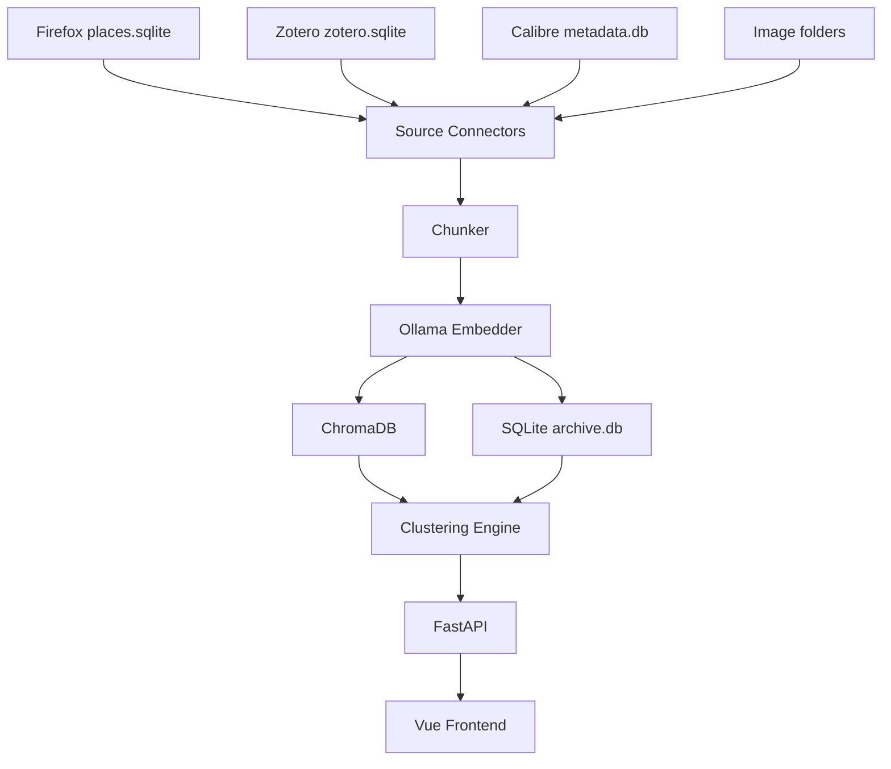
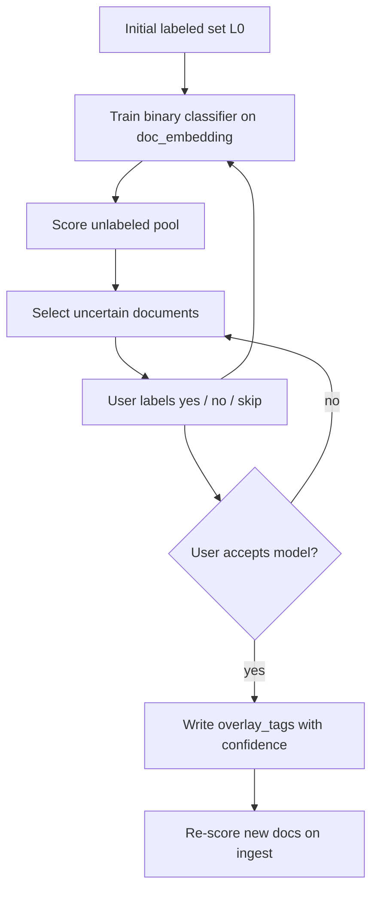

# Alexandria Design Notes

The authoritative design specification for Alexandria is
the PDF design document (kept separately by the author). This file holds
supplementary notes accumulated during implementation and the v0.2.0 audit
pass, organised so they can be cross-referenced from the code.

If the PDF is added to the source tree, place it at `docs/design.pdf` and
treat its statements as overriding anything written below.

## 1. Data flow

### Model backends (providers)

Every LLM / vision / OCR / image-embedding call goes through a swappable
**provider** in `pka/providers/` rather than talking to a backend directly.
Selection is **per-capability** via config, so remote chat can run alongside
local OCR/embeddings:

| Capability | Config setting | Backends | Interface (`pka/providers/base.py`) |
|-----------|----------------|----------|-------------------------------------|
| Chat (text→JSON) | `chat_provider` | ollama, openrouter, ovh | `ChatProvider` |
| Vision (image→text) | `vision_provider` | ollama, openrouter, ovh | `VisionProvider` |
| OCR (image→text) | `ocr_provider` | tesseract | `OcrProvider` |
| Image embed (CLIP) | `image_embed_provider` | clip | `ImageEmbedder` |

OpenRouter and OVH share one OpenAI-compatible implementation
(`openai_compat.py`); credentials/models come from `ALEXANDRIA_OPENROUTER_*` /
`ALEXANDRIA_OVH_*`. Callers use the accessors in `pka/providers/__init__.py`
(`get_chat_provider()` etc.); the historical `pka.ollama_chat.chat_json` and
`image_extractor.classify_and_describe` / `ocr_image` / `clip_embed_*` are thin
shims over these. **Text-chunk** embeddings are intentionally *not* here — they
stay inside ChromaDB's built-in function (see `pka/storage/vector_store.py`).

## 2. Adding a new source connector

To add a new source (e.g. Pocket, Raindrop, Readwise):

1. Create `pka/connectors/<source>.py` exposing a `load_items()` function
   that returns a list of dataclass objects with at minimum the fields
   `source_id`, `title`, `tags`, `date_added`.

2. Add the source to the `Source` enum in `pka/constants.py`.

3. Add `pka/ingestion/runners/<source>.py` with metadata/embed steps routing
   text through `ingest_text_block()` in `pka/ingestion/core.py`.

4. Add `pka/ingestion/<source>_sync.py` with `sync_<source>_metadata` /
   `sync_<source>_ingest` (and optional `sync_<source>` full pipeline).

5. Register handlers in `pka/ingestion/registry.py` (used by the ingestion API).

6. Add `count_pending_metadata()` coverage in `pka/ingestion/pending_metadata.py`
   if the source is document-based.

7. Add `scripts/run_<source>.py` calling the `sync_*` entry points.

8. Add a fixture in `tests/conftest.py` and a test module
   `tests/test_connector_<source>.py`.

9. Add an entry to the sidebar in `frontend/src/components/AppSidebar.vue`.

### 2.1 YouTube saved-videos connector (cloud exception)

The YouTube connector (`Source.YOUTUBE`) is the **only** connector that reaches
an external network API rather than a local file. This is a deliberate, scoped
exception to the local-first rule, not a precedent for other cloud sources:

- **Inert by default.** Nothing happens unless the user configures a desktop-app
  OAuth client secret (`ALEXANDRIA_YOUTUBE_CLIENT_SECRET`). No credentials → the
  source reports "unavailable" and every status poll stays network-free
  (`count_pending_metadata` / `source_corpus_size` return 0 for YouTube; the real
  pending count is computed inline from the loaded videos in
  `sync_youtube_metadata`).
- **Read-only, local token.** Scope is `youtube.readonly`; the OAuth refresh
  token is cached at `data/youtube_token.json` (git-ignored) and never leaves the
  machine. No telemetry, no writes back to YouTube.
- **Optional dependency.** `google-api-python-client` / `google-auth-oauthlib`
  live in the `youtube` extra and are lazy-imported inside the auth helpers, so
  `pka.connectors.youtube` imports (and unit-tests, via an injected fake
  `service`) without them installed.
- **Metadata only.** `load_saved_videos()` lists the Liked-videos playlist plus
  all owned playlists, dedupes videos across playlists (playlists → source
  collections, earliest add time → `date_added`), and hydrates title/channel/
  description/tags via `videos.list`. Embed text is
  `title + channel + description + tags`. Note: the Data API no longer exposes
  *Watch Later*, so it is not included. Transcript enrichment is deferred
  (`BACKLOG.md`).

Otherwise the connector follows the standard §2 checklist and the Zotero-style
two-phase flow (metadata import, then embed — no async fetch phase).

## 3. Two-phase ingestion model

Calibre and Firefox follow a two-phase pattern:

- **Phase 1** is fast and deterministic. It writes document rows and
  embeds whatever cheap text is immediately available (title + abstract
  for Zotero, title + description for Calibre, bookmark metadata for
  Firefox). Phase 1 is what every routine `python scripts/run_*.py`
  performs.

- **Phase 2** is slow and side-effecting. It pulls full-text from PDFs/EPUBs
  (Calibre) or fetches and extracts HTML and remote PDFs (Firefox) and embeds
  the result.
  Chunk indices are offset past the phase-1 chunks via `existing_chunk_count()`
  so the two passes coexist in a single document.

Phase-2 work is gated behind `--fulltext` (Calibre) or runs through
`pka.ingestion.fetcher.fetch_and_embed_pending()` (Firefox). Each worker
fetches one URL, persists fetch metadata, embeds immediately, then moves on—
extracted text is not batched in RAM. Docs marked `fetched` but missing
chunks are re-queued automatically on the next ingest run. When a Firefox URL
returns HTTP 404, the fetcher can fall back to the closest Internet Archive
snapshot (`fetch_wayback_fallback`, default on).

Firefox phase 2 also uses domain-specific handlers instead of raw HTML scrape
where APIs exist: Wikipedia (MediaWiki), Amazon product pages, **arXiv**
(`export.arxiv.org` metadata + PDF — updates `documents.title` and
`documents.card_summary` from the abstract), and **bioRxiv** (`api.biorxiv.org`
DOI lookup + PDF, same card fields).

## 4. Cluster lifecycle

Every clustering run is stored regardless of acceptance. The UI surfaces
runs through `/runs` and lets the operator accept exactly one as the active
run. Drift detection (`compute_drift`) and merge suggestions
(`compute_merge_suggestions`) operate against the active run and flag
clusters that may need to be split or merged, but never act automatically.

Clustering uses **hierarchical HDBSCAN** (PCA space by default): level-2
subclusters are labelled via LLM from document titles plus content excerpts
(`card_summary` or first chunk); level-1 labels summarize L2 child labels when
subclusters exist, otherwise the same title+content sampling. The cluster explorer
lets you edit labels inline, regenerate via LLM, and apply the stored label as
an overlay tag (`cluster_l1` / `cluster_l2` origins) for browse filtering.

## 5. Active learning tag training

**Status:** implemented on branch `active-learning-tags` (backend + v1 UI).

Alexandria already has several tagging mechanisms that do not overlap with this one:

| Mechanism | Location | Role today |
|-----------|----------|------------|
| Source tags | `source_tags` | Imported from Zotero/Firefox; read-only |
| Rule-based classification | `pka/classification.py` | Fixed tags `{academic, paper, preprint}` at ingest; `TagOrigin.INFERRED` |
| Manual / cluster overlay tags | `overlay_tags`, `pka/clustering/cluster_tags.py` | User edits or cluster-label overlays (`cluster_l1` / `cluster_l2`) |
| Unsupervised structure | `pka/clustering/engine.py` | HDBSCAN groups; no per-tag classifier |
| Document vectors | `documents.doc_embedding`, `pka/clustering/doc_embeddings.py` | 384-d MiniLM mean-pool — reuse as classifier features |

Active learning fills the gap: **user-defined, semantic tags** learned from
examples, not hard-coded rules or unsupervised cluster labels.

At the algorithm boundary the trainer accepts only a **labeled document set** —
pairs of `(document_id, label)` where `label ∈ {positive, negative}`. The UI
must translate user actions into that set; §5.2 lists the required affordances.
Other shortcuts may be added later without changing the trainer API.

### 5.1 Motivation and scope

- **Goal:** train a **binary classifier for one tag at a time** (e.g.
  `#transformers`, `#to-read-later`, `#systems-research`).
- **Granularity:** document-level (matches browse UI, `overlay_tags`, and
  cached `doc_embedding`).
- **Local-first:** train and infer on-device with scikit-learn (already a
  dependency); no cloud APIs.
- **Human-in-the-loop:** the system suggests candidates; the user confirms or
  rejects. Auto-apply only after explicit acceptance (mirrors cluster run
  acceptance in §4).

### 5.2 Initial labeled set (algorithm input)

The only required starting input is **`L₀`**: a set of `(document_id, label)`
with `label ∈ {0, 1}` (negative / positive for the target tag).

- The target **tag string** is chosen when the session is created; it names
  what the classifier learns.
- **Seed rows are positives only.** Neither v1 seed affordance writes
  `source=seed` with `label=0`. There are no seed negatives in this setup.
- Typical sessions therefore start with **positives only** in `L₀`. The engine
  may add a small random **bootstrap** negative set (`source=auto`) so the first
  model can train when no negative exists yet. The user adds negatives via the
  Yes/No queue (`source=user`, `label=0`).
- Below roughly five positives the model is unstable; the UI should warn but
  not block.
- All `L₀` rows are persisted with `source=seed` (always `label=1` today).
  Subsequent Yes/No feedback appends with `source=user`.

**Required seed affordances** (v1 UI — both map to positive `L₀` before the first train):

1. **From a source tag** — user selects a tag with `origin=source` (Tag browser
   row action, or equivalent in `BrowseNavPanel` source-tag list). Alexandria resolves
   all `document_id` values in `source_tags` for that `tag_string` and seeds
   `label=1` for each. User then names the **target tag** for the classifier
   (may match the source tag string or be a new overlay tag, e.g. learn a
   `learned` tag `systems-research` from Zotero folder tag `SR`). Docs without
   `doc_embedding` are skipped or queued for refresh before training.

2. **From browse selection** — user multi-selects documents in `BrowseView`
   via **checkboxes** on each result row/card. A bulk action bar appears when the
   selection is non-empty (“Train classifier…”). User names the target tag;
   selected docs become `L₀` positives (`label=1`). Selection respects current
   browse/search filters but is independent of them once captured (session
   stores explicit `document_id` list).

Optional `provenance` on the session may record `from_source_tag` or
`from_browse_selection` for display only.

### 5.3 Active learning loop

Optionally, while `status=labeling`, the user may run **pseudo-labeling** (model
threshold or LLM batch) to grow the labeled set without reviewing the queue,
then continue uncertainty sampling.

**Query strategy (recommended default):** uncertainty sampling on predicted
P(positive) — prioritize scores nearest 0.5. Batch size configurable (e.g.
10–20 per round). Documents already present in `tag_training_labels` are
excluded from the queue.

**Pseudo-labeling (optional, user-triggered):**

Both modes only add labels for documents with **no existing row** in
`tag_training_labels` for that session, then retrain. They never overwrite
seed or user labels.

| Mode | Endpoint | Writes | Uses for training |
|------|----------|--------|-------------------|
| Model threshold | `POST …/pseudo-label` `{ "mode": "model" }` | `source=pseudo` | yes |
| LLM one-shot | `POST …/pseudo-label` `{ "mode": "llm", "batch_size": N? }` | `source=pseudo_llm` | yes |

1. **Model threshold** — score unlabeled documents (must have `doc_embedding`);
   add `label=1` when P(positive) ≥ `pseudo_label_high` (default **0.95**), or
   `label=0` when P(positive) ≤ `pseudo_label_low` (default **0.05**).

2. **LLM one-shot** — for each document in a **random subset** of the unlabeled
   pool (size `pseudo_llm_batch_size`, default **20**), one Ollama call decides
   0/1. Prompt context:
   - **Tag name** (session slug).
   - **Seed collection** — up to `pseudo_llm_seed_max` (default **8**) documents
     with `source=seed`, `label=1` (the initial positive collection only).
   - **Negatives** — if the user has marked any **No** in the queue, up to
     `pseudo_llm_negatives` (default **5**) examples from `source=user`,
     `label=0`; otherwise the same count of **random** documents drawn from the
     unlabeled pool (not seed negatives — there are none). Prompt wording reflects
     which case was used (`negative_source`: `user` | `random` in the API
     response).

**What does not enter `tag_training_labels`:** raw classifier scores on accept
or ingest (those go to `overlay_tags` with `origin=learned` only). Stray
`source=predicted` rows are ignored by the trainer if present.

**Training label sources** (all may retrain the logistic model): `seed`, `user`,
`auto`, `pseudo`, `pseudo_llm`.

**Stopping:** user-driven (accept model, pause session, or discard). Optional
metrics in UI: precision/recall on a hold-out slice of user labels, label
count, rounds completed.

### 5.4 Classifier design

- **Features:** L2-normalized `documents.doc_embedding` (384-d); refresh via
  `refresh_document_embedding()` in `pka/clustering/doc_embeddings.py` when
  missing.
- **Model:** `sklearn.linear_model.LogisticRegression` or `SGDClassifier` with
  `loss="log_loss"` — fast retrain each round, serializable coefficients,
  interpretable.
- **Output:** P(tag) per document; threshold default 0.5, tunable before apply.
- **Why not LLM zero-shot:** aligns with Alexandria privacy model; cheaper at scale;
  complements (does not replace) optional LLM cluster labeling in §4.

### 5.5 Data model

Tables in `pka/db/schema.py`:

- **`tag_training_sessions`** — one row per tag-training project. Fields:
  `session_id`, `tag` (slugified via `slugify_tag()`), `status` (`labeling` |
  `accepted` | `archived`), `model_blob` (serialized logistic regression JSON),
  `parameters` (JSON — see below), `provenance` (optional JSON for UI),
  `notes` (train stats JSON), `created_at`, `accepted_at`.

- **`tag_training_labels`** — ground truth for a session. Fields:
  `session_id`, `document_id`, `label` (0/1), `source`, `created_at`. Unique on
  `(session_id, document_id)`. Upsert updates `label` and `source` when the same
  doc is relabeled.

| `source` | Meaning |
|----------|---------|
| `seed` | Initial collection; **positives only** in v1 (`label=1`) |
| `user` | Yes/No from the uncertainty queue (or resume labeling) |
| `auto` | Random bootstrap negatives when the session has no negative yet |
| `pseudo` | High-confidence model threshold pseudo-labels |
| `pseudo_llm` | LLM one-shot pseudo-labels on a random unlabeled batch |

- **Applied predictions** — `overlay_tags` with `TagOrigin.LEARNED` and
  `confidence` = P(tag). Written on session accept (archive-wide) and on ingest
  via `apply_learned_tags_for_document()` for accepted sessions.

**Session `parameters` defaults** (`pka/tag_training/engine.py`):

| Key | Default | Used by |
|-----|---------|---------|
| `threshold` | 0.5 | Accept / ingest overlay apply |
| `queue_batch_size` | 10 | Uncertainty queue |
| `pseudo_label_high` | 0.95 | Model pseudo-label positives |
| `pseudo_label_low` | 0.05 | Model pseudo-label negatives |
| `pseudo_llm_batch_size` | 20 | Random count of docs to LLM-label |
| `pseudo_llm_seed_max` | 8 | Seed positives in LLM prompt |
| `pseudo_llm_negatives` | 5 | User or random negatives in LLM prompt |

LLM pseudo-label runs **sequentially** (one Ollama call per doc in the batch). The UI
request timeout scales with batch size (~65s per doc, cap 30 min). Vite proxies
`/tag-training` with the same cap. Per-call Ollama timeout:
`ALEXANDRIA_TAG_TRAINING_LLM_CHAT_TIMEOUT_SECONDS` (default 60).

### 5.6 Lifecycle and maintenance

Mirror §4 cluster patterns in `pka/clustering/lifecycle.py`:

- **Accept session:** mark one session per tag as active; write `overlay_tags`
  with `origin=learned` for docs above threshold.
- **Revoke:** delete `learned` overlay rows for that tag/session; keep label
  history for retraining.
- **New documents:** after `refresh_document_embedding()` in
  `pka/clustering/doc_embeddings.py`, `apply_learned_tags_for_document()`
  scores the document against every **accepted** session and writes or clears
  `learned` overlay tags using each session’s threshold.
- **Resume training:** `POST /tag-training/sessions/{id}/resume` sets an
  accepted session back to `labeling` (model and labels kept). Re-accept after
  more labeling to refresh archive-wide tags.
- **Stale models:** optional drift flag when mean embedding of recent false
  positives diverges from the positive centroid (reuse drift pattern from §4).

### 5.7 API and UI

Backend: `pka/tag_training/` (`engine.py`, `lifecycle.py`, `llm_classifier.py`),
router `pka/api/routers/tag_training.py`, Vite proxy `/tag-training`.

**Endpoints (implemented):**

- `GET /tag-training/sessions` — list sessions
- `POST /tag-training/sessions` — `{ tag, labels: [{ doc_id, label }] }`
- `POST /tag-training/sessions/from-source-tag` — `{ source_tag, target_tag }`
- `GET /tag-training/sessions/{id}` — session detail + counts
- `GET /tag-training/sessions/by-tag/{tag}` — resumable session for a tag
- `GET /tag-training/sessions/{id}/queue` — uncertainty batch
- `POST /tag-training/sessions/{id}/labels` — batch Yes/No (`source=user`)
- `POST /tag-training/sessions/{id}/train` — force retrain
- `POST /tag-training/sessions/{id}/pseudo-label` — `{ mode: "model" | "llm", batch_size? }`
- `POST /tag-training/sessions/{id}/resume` — accepted → labeling
- `POST /tag-training/sessions/{id}/accept` — apply model to archive
- `POST /tag-training/sessions/{id}/archive` — archive session

**Tag browser** (`TagView.vue`): for rows with `origin=source`, add action
“Train classifier…” → target-tag prompt → create session via source-tag seed.

**Browse** (`BrowseView.vue`, `DocCard.vue`, `DocGridCard.vue`):

- Checkbox per document; “select all on page” optional.
- Selection state in browse store (or dedicated composable), cleared on navigation
  away or explicit deselect.
- Sticky bulk bar when `selectedIds.length > 0`: count + “Train classifier…” →
  target-tag prompt → `POST /tag-training/sessions` with selected ids as
  positives.
- Checkbox click must not open the detail panel (stop propagation on card).

**Training view** (`/tags/train/:sessionId`, `TagTrainView.vue`): target tag, seed
summary, label counts, uncertainty queue (Yes/No), pseudo-label actions (model +
LLM), accept / resume. Reuse `DocDetailPanel` for context while labeling.

Browse filter: extend `list_documents()` in `pka/db/queries.py` with
`learned_tags` (same pattern as `overlay_tags` / `cluster_l1_tags`).

### 5.8 Non-goals and open questions

**Non-goals:**

- Multi-label joint training (one session = one tag)
- Chunk-level tagging
- Replacing source tags
- Automatic promotion of `learned` → `manual`

**Open questions:**

- Default scope of the unlabeled scoring pool (whole archive vs. filtered
  subset)
- Whether to allow multiple concurrent accepted models per tag string
- Image documents (`images` table) — out of scope until doc-level parity
  exists

**Explicitly deferred:** additional seed affordances beyond source-tag and
browse multi-select (reading lists, cluster membership, etc.).
