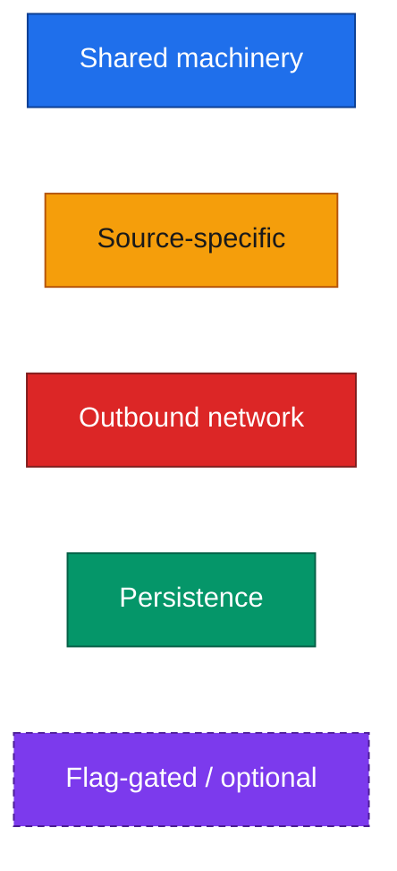
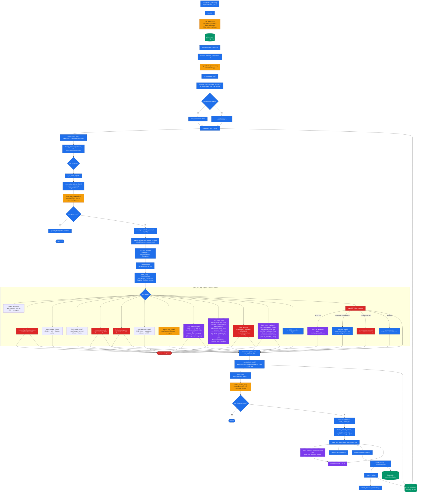

# Ingestion flow graphs

One graph per source, drawn from the code as of `trunk`. Expands the single
`Source Connectors` box in `DESIGN.md` §1 and the pattern described in §3.

> **Derived, and unverified by any test.** These graphs are a drawing of what
> `pka/` does; the code and `DESIGN.md` both outrank them, so where they
> disagree the graph is what's wrong. Nothing fails when they go stale, which is
> why the rule in `CLAUDE.md` asks for them to be redrawn **in the same commit**
> as any change to a pipeline's phase shape, the shared/source-specific
> boundary, the set of gated outbound calls, or the shared tail. To redraw, read
> `ingestion/registry.py` (handler map and `PHASE_SPECS`) → `<source>_sync.py`
> (phases) → `runners/<source>.py` (the text handed to `ingest_text_block`) →
> `connectors/<source>.py` (how the corpus is read).

Every graph uses the same colour scheme, so the shared spine stays recognisable
across pipelines:

| Colour | Meaning |
|--------|---------|
| 🟦 **blue** | **Shared machinery** — code every (or nearly every) pipeline runs: `pka/ingestion/core.py`, `loops.py`, `progress/`, `sync_shared.py`, `registry.py`, `fetcher.py`, `db/queries.py` |
| 🟧 **amber** | **Source-specific** — the connector and runner written for this source alone |
| 🟥 **red** | **Outbound network** — a call that leaves `localhost` |
| 🟩 **green** | **Persistence** — SQLite (`documents`, `alexandria_chunks`, sidecar tables) and ChromaDB |
| 🟪 **purple, dashed** | **Flag-gated / optional** — off unless a named setting turns it on (`DESIGN.md` §1.1) |

---

## 0. The shared spine

Every source is reached through the same registry, reports through the same three
progress phases (`metadata` → `fetching` → `embedding`), and ends in the same
chunk/embed/persist tail. What differs is only how a source is *read* and what
text it hands to `ingest_text_block`.

```mermaid
flowchart TD
    subgraph entry["Job launch"]
        API["POST /api/ingestion/sync<br/>pka/api/routers/ingestion.py"]
        CLI["alexandria &lt;source&gt;<br/>pka/cli.py"]
        REG["require_handlers(src)<br/>ingestion/registry.py"]
        SPEC["phase_spec(src) — PHASE_SPECS"]
        API --> REG
        CLI --> REG
        REG --> SPEC
    end

    subgraph metaphase["Phase: metadata"]
        META["sync_&lt;source&gt;_metadata()"]
        BASE["archive_document_count()<br/>count_pending_metadata()"]
        BEGIN["sp.begin_metadata_sync(key, pending, baseline)"]
        LOAD["connector load — source-specific"]
        TAKE["take(items, source)<br/>ingestion/dev_limits.py"]
        MLOOP["run_metadata_loop()<br/>ingestion/loops.py"]
        PERSIST["_persist(item) — source-specific"]
        INS["insert_document_if_new()<br/>insert_source_tags / _collections"]
        TICK1["tick(key, failed=…) / should_stop(key)"]
        META --> BASE --> BEGIN --> LOAD --> TAKE --> MLOOP --> PERSIST --> INS
        MLOOP -->|per item| TICK1
    end

    subgraph ingphase["Phase: fetching + embedding"]
        INGEST["sync_&lt;source&gt;_ingest()"]
        CORPUS["sp.set_corpus_total(key, n)"]
        FETCHQ{"needs network fetch?"}
        SKIPF["sp.skip_phase(key, 'fetching')"]
        FETCH["fetch_and_embed_pending()<br/>ingestion/fetcher.py"]
        SETE["sp.set_phase(key, 'embedding', n)"]
        ELOOP["run_embed_loop()<br/>ingestion/loops.py"]
        PROC["_process(item) — source-specific<br/>builds the text to embed"]
        INGEST --> CORPUS --> FETCHQ
        FETCHQ -->|Firefox, Reddit link posts| FETCH
        FETCHQ -->|Zotero, Calibre, YouTube, Images| SKIPF
        SKIPF --> SETE --> ELOOP --> PROC
        FETCH --> PROC
    end

    subgraph tail["Shared tail — ingestion/core.py"]
        TAIL["ingest_text_block(doc_id, text, source, …)"]
        CHUNK["sentence_window_chunks()<br/>ingestion/chunker.py"]
        FB{"no chunks and<br/>fallback_text given?"}
        FBUSE["embed fallback as one chunk"]
        UPS["upsert_chunks() → embedding model<br/>storage/vector_store.py"]
        SQL["insert_chunks() — mirrors §3.2<br/>provenance into SQLite"]
        DOCEMB["refresh_document_embedding()<br/>clustering/doc_embeddings.py"]
        TAIL --> CHUNK --> FB
        FB -->|yes| FBUSE --> UPS
        FB -->|no| UPS
        UPS --> SQL --> DOCEMB
    end

    REG --> META
    INS --> FULL{"run_full_sync()<br/>sync_shared.py"}
    FULL -->|stopped / unavailable| END1(["return meta"])
    FULL --> INGEST
    PROC --> TAIL

    SUM["attach_summary_chunk()<br/>gate: _SUMMARY_FLAGS per source"]
    SUMHIT{"generated_summary cached?"}
    SUMRUN["current_run_id(SUMMARY)<br/>enrichment_runs.py — opens lazily,<br/>records provider + resolved model"]
    SUMLLM["summarize_text() → LLM<br/>record_call() per provider call"]
    SUMCACHE[("documents.generated_summary<br/>+ summary_run_id stamp")]
    RUNS[("SQLite<br/>enrichment_runs")]
    PROC -.optional.-> SUM
    SUM --> SUMHIT
    SUMHIT -->|yes, no inference| TAIL
    SUMHIT -->|no| SUMRUN --> SUMLLM --> SUMCACHE --> TAIL
    SUMRUN --> RUNS
    SUMLLM --> RUNS

    CHROMA[("ChromaDB<br/>alexandria_chunks")]
    SQLITE[("SQLite<br/>documents, chunks, tags")]
    UPS --> CHROMA
    SQL --> SQLITE
    INS --> SQLITE

    classDef shared   fill:#1f6feb,stroke:#0b3d91,stroke-width:1px,color:#ffffff
    classDef specific fill:#f59e0b,stroke:#b45309,stroke-width:1px,color:#1a1a1a
    classDef external fill:#dc2626,stroke:#7f1d1d,stroke-width:1px,color:#ffffff
    classDef store    fill:#059669,stroke:#065f46,stroke-width:1px,color:#ffffff
    classDef gated    fill:#7c3aed,stroke:#4c1d95,stroke-width:1px,color:#ffffff,stroke-dasharray:4 3

    class API,CLI,REG,SPEC,META,BASE,BEGIN,TAKE,MLOOP,TICK1,INS,FULL,END1,INGEST,CORPUS,FETCHQ,SKIPF,FETCH,SETE,ELOOP,TAIL,CHUNK,FB,FBUSE,UPS,SQL,DOCEMB,SUMHIT,SUMRUN shared
    class LOAD,PERSIST,PROC specific
    class SUM,SUMLLM gated
    class CHROMA,SQLITE,SUMCACHE,RUNS store
```

---

## 1. Zotero

Two phases, no fetch phase: the library is already on disk and the embeddable
text is `title + creators + abstract + annotations`, so `fetching` is skipped
outright. Zotero is the only source whose read starts by **snapshotting** the
upstream SQLite file. No generated summary — an item already carries its abstract.

```mermaid
flowchart TD
    START["sync_zotero_metadata()<br/>ingestion/zotero_sync.py"]
    INIT["init_db()"]
    BASE["archive_document_count(ZOTERO)<br/>count_pending_metadata(ZOTERO)"]
    BEGIN["sp.begin_metadata_sync('zotero', …)"]

    COPY["ensure_zotero_copy()<br/>snapshot zotero.sqlite (dev: reuse)"]
    ZDB[("zotero.sqlite<br/>read-only copy")]
    LOAD["load_items()<br/>items + tags + collections + annotations"]
    TAKE["take(items, ZOTERO)"]

    MRUN["ingest_zotero_metadata()<br/>runners/zotero.py"]
    MLOOP["run_metadata_loop()"]
    KW["_zotero_document_kwargs()<br/>fetch_status = AVAILABLE if pdf_path else PENDING"]
    INSDOC["insert_document_if_new()"]
    TAGS["insert_source_tags()<br/>insert_source_collections()"]
    CLS["classify_document(ZOTERO, item_type, url_or_path)<br/>sync_classification_tags()"]
    CARD["update_card_summary(zotero_card_summary(item))<br/>highlight, else abstract"]
    ATTK["refresh_zotero_metadata()"]

    START --> INIT --> BASE --> BEGIN --> COPY --> ZDB --> LOAD --> TAKE --> MRUN
    MRUN --> MLOOP --> KW --> INSDOC --> TAGS --> CLS --> CARD --> ATTK

    ATTK --> FULL{"run_full_sync()"}
    FULL --> ING["sync_zotero_ingest()"]

    PLAN["_load_zotero_items_for_embed()"]
    KEYS["load_item_keys(skip_copy=True)"]
    HAVE["source_ids_with_chunks(ZOTERO)"]
    DIFF["pending = all_keys − already embedded"]
    RELOAD["load_items(keys=pending)"]
    SKIPF["sp.skip_phase('zotero', 'fetching')"]
    SETE["sp.set_phase('zotero', 'embedding', n)"]

    ING --> PLAN --> KEYS --> HAVE --> DIFF --> RELOAD --> SKIPF --> SETE

    ERUN["ingest_zotero_embed()"]
    ELOOP["run_embed_loop()"]
    UPD["upsert_document() when the row is missing"]
    TEXT["zotero_embed_text(item)<br/>title + creators + abstract + annotations"]
    BLOCK["ingest_text_block(min_chars=1)"]
    CHUNK["sentence_window_chunks()"]
    UPSC["upsert_chunks() → embedding model"]
    INSC["insert_chunks()"]
    DOCEMB["refresh_document_embedding()"]

    SETE --> ERUN --> ELOOP --> UPD --> TEXT --> BLOCK --> CHUNK --> UPSC --> INSC --> DOCEMB

    NOSUM["no attach_summary_chunk:<br/>ZOTERO is absent from _SUMMARY_FLAGS"]
    BLOCK -.-> NOSUM

    SQLITE[("SQLite: documents, tags,<br/>collections, chunks")]
    CHROMA[("ChromaDB: alexandria_chunks")]
    INSDOC --> SQLITE
    TAGS --> SQLITE
    INSC --> SQLITE
    UPSC --> CHROMA

    classDef shared   fill:#1f6feb,stroke:#0b3d91,stroke-width:1px,color:#ffffff
    classDef specific fill:#f59e0b,stroke:#b45309,stroke-width:1px,color:#1a1a1a
    classDef external fill:#dc2626,stroke:#7f1d1d,stroke-width:1px,color:#ffffff
    classDef store    fill:#059669,stroke:#065f46,stroke-width:1px,color:#ffffff
    classDef gated    fill:#7c3aed,stroke:#4c1d95,stroke-width:1px,color:#ffffff,stroke-dasharray:4 3

    class START,INIT,BASE,BEGIN,TAKE,MLOOP,INSDOC,TAGS,CLS,CARD,FULL,ING,HAVE,DIFF,SKIPF,SETE,ELOOP,UPD,BLOCK,CHUNK,UPSC,INSC,DOCEMB shared
    class COPY,LOAD,MRUN,KW,ATTK,PLAN,KEYS,RELOAD,ERUN,TEXT,NOSUM specific
    class ZDB,SQLITE,CHROMA store
```

---

## 2. Firefox

The only pipeline with `plans_own_phases=True, tracks_embedding=False`
(`registry.PHASE_SPECS`): its work is unknown until the fetch queue is built, and
every fetched page is embedded **inline by the fetch worker**, so there is no
separate embedding phase to report. Everything from `fetch_and_embed_pending`
down is shared with Reddit's link-post branch.

The dispatch chain's newest arrivals are the **publisher handlers**
(`planning/archive/PUBLISHER_FETCH_HANDLERS.md`), and they exist to remove two opposite
failures. `journals.aps.org`, `mitpress.mit.edu`, `direct.mit.edu` and `researchgate.net`
answer a non-browser client with `403`, so those bookmarks land as
`unfetchable` with no title at all. `nature.com`, `link.springer.com`, `sciencedirect.com` and
`doi.org` are worse: they answer `200` with a paywall, which trafilatura
extracts and the pipeline then chunks and embeds as if it were the paper —
invisible in the unfetchable report, because they rank on documents, not on
failures. Both are avoided the same way: the URL carries a resolvable identifier
(a DOI, an Elsevier PII, an ISBN, a citation's volume/issue/page, or a title
slug), so the publisher's HTML is never requested. `direct.mit.edu` is the one
that sometimes has to *search* for its identifier rather than read it — and it
is allowed to only because the URL's volume, issue and page can verify the hit,
which is the check `researchgate.net` has nothing to perform. The same check
guards its cheaper route, where a PDF filename spells the DOI suffix outright. Note the colours — `researchgate.net` is orange, not red,
because it makes **no request at all**.

---

## 3. Calibre

Local library, no fetch phase, but **two embedding passes**: a cheap
`pass="metadata"` over every book, then `pass="fulltext"` over the books whose
file exists on disk. It is the only pipeline that calls `set_phase('embedding')`
twice. Both outbound touches (`lookup_book`, `summarize_text`) are default-off.

```mermaid
flowchart TD
    START["sync_calibre_metadata()<br/>ingestion/calibre_sync.py"]
    INIT["init_db()"]
    AVAIL["try_load_calibre_books()<br/>ingestion/source_access.py"]
    OK{"metadata.db present?"}
    UNAV["unavailable_metadata()<br/>sync_shared.py — skip_phase + empty stats"]
    ENDU(["unavailable"])
    LOADB["load_books()<br/>connectors/calibre.py — metadata.db copy,<br/>_resolve_format_path → preferred EPUB/PDF"]
    CDB[("Calibre metadata.db<br/>read-only copy")]
    TAKE["take(books, CALIBRE)"]
    BEGIN["sp.begin_metadata_sync('calibre', …)"]

    START --> INIT --> AVAIL --> OK
    OK -->|no| UNAV --> ENDU
    OK -->|yes| LOADB --> CDB --> TAKE --> BEGIN

    MRUN["ingest_calibre_metadata()<br/>runners/calibre.py"]
    MLOOP["run_metadata_loop()"]
    SPLIT["split_calibre_tags()<br/>real tags vs leftover note text"]
    FS["fetch_status = AVAILABLE if preferred_path else MISSING"]
    INSDOC["insert_document_if_new(note=…)"]
    TAGS["insert_source_tags()<br/>insert_source_collections(series)"]
    NOCLS["no classify_document():<br/>Calibre carries its own tags"]

    BEGIN --> MRUN --> MLOOP --> SPLIT --> FS --> INSDOC --> TAGS
    TAGS -.-> NOCLS

    TAGS --> FULL{"run_full_sync()"}
    FULL --> ING["sync_calibre_ingest()"]
    COUNT["n = books; n_files = books whose file exists"]
    SKIPF["sp.skip_phase('calibre','fetching')"]
    SETE1["sp.set_phase('calibre','embedding', n)"]
    ING --> COUNT --> SKIPF --> SETE1

    subgraph pass1["Pass 1 — metadata embed (every book)"]
        P1["ingest_calibre_books()"]
        ELOOP1["run_embed_loop()"]
        SKIP1["skip when source_id already has chunks"]
        MT["metadata_text(title, description, authors)<br/>book_extractor.py"]
        B1["ingest_text_block(pass='metadata',<br/>fallback_text=title)"]
        SYN{"Calibre description empty?"}
        NOOP1(["no lookup — pass 1 already embedded it"])
        LOOK["_attach_book_synopsis() → lookup_book()<br/>gate: external_lookup_enabled"]
        LADDER["ISBN → Open Library title/author<br/>→ book_search second catalogue"]
        B2["ingest_text_block(pass='external_synopsis',<br/>chunk_offset=existing_chunk_count)"]
        P1 --> ELOOP1 --> SKIP1 --> MT --> B1 --> SYN
        SYN -->|yes| LOOK --> LADDER --> B2
        SYN -->|no| NOOP1
    end

    subgraph pass2["Pass 2 — full text (books with a file)"]
        P2["ingest_calibre_fulltext()"]
        EXTRACT["extract_book_report(path, max_pages)"]
        DISP{"file suffix"}
        EPUB["extract_epub() — per-chapter sections"]
        PDFX["extract_pdf_report() — page-numbered sections<br/>+ text-layer verdict"]
        NOTEXT["no sections, verdict no_text_layer:<br/>set_fetch_status(NO_TEXT_LAYER)<br/>— OCR candidate, never re-queued"]
        SECT["for each section:<br/>ingest_text_block(pass='fulltext',<br/>section_title, section_index,<br/>page_start/page_end, chunk_offset)"]
        SUM["attach_summary_chunk(CALIBRE, full_text)<br/>gate: book_summary_enabled"]
        LLM["summarize_text() — map-reduce over the book"]
        P2 --> EXTRACT --> DISP
        DISP -->|.epub| EPUB --> SECT
        DISP -->|.pdf| PDFX --> SECT
        PDFX -->|scan| NOTEXT
        SECT --> SUM --> LLM
    end

    SETE1 --> P1
    NETOL(["Open Library / catalogue API"])
    LADDER --> NETOL

    STOP1{"stopped, or n_files == 0?"}
    ENDE(["return stats"])
    SETE2["sp.set_phase('calibre','embedding', n_files)"]
    B1 --> STOP1
    STOP1 -->|yes| ENDE
    STOP1 -->|no| SETE2 --> P2

    TAIL["sentence_window_chunks() → upsert_chunks()<br/>→ insert_chunks() → refresh_document_embedding()"]
    B1 --> TAIL
    B2 --> TAIL
    SECT --> TAIL
    LLM --> TAIL

    SQLITE[("SQLite: documents, tags,<br/>collections, chunks")]
    CHROMA[("ChromaDB: alexandria_chunks")]
    INSDOC --> SQLITE
    TAIL --> SQLITE
    TAIL --> CHROMA

    classDef shared   fill:#1f6feb,stroke:#0b3d91,stroke-width:1px,color:#ffffff
    classDef specific fill:#f59e0b,stroke:#b45309,stroke-width:1px,color:#1a1a1a
    classDef external fill:#dc2626,stroke:#7f1d1d,stroke-width:1px,color:#ffffff
    classDef store    fill:#059669,stroke:#065f46,stroke-width:1px,color:#ffffff
    classDef gated    fill:#7c3aed,stroke:#4c1d95,stroke-width:1px,color:#ffffff,stroke-dasharray:4 3

    class START,INIT,AVAIL,OK,UNAV,ENDU,TAKE,BEGIN,MLOOP,FS,INSDOC,TAGS,FULL,ING,SKIPF,SETE1,ELOOP1,SKIP1,B1,B2,STOP1,ENDE,SETE2,TAIL,NOOP1,NOTEXT shared
    class LOADB,MRUN,SPLIT,COUNT,P1,MT,SYN,P2,EXTRACT,DISP,EPUB,PDFX,SECT,NOCLS specific
    class NETOL external
    class LOOK,LADDER,SUM,LLM gated
    class CDB,SQLITE,CHROMA store
```

---

## 4. Reddit

The hybrid. Metadata comes from the private Atom feed; the ingest phase then
**forks on `external_url`** — link posts go through the shared Firefox fetcher,
self-posts and comments are embedded from their inline body. It is the only
source that archives every upstream response before parsing it, and the only one
that passes `material` / `context` to the summariser. That archive also feeds
ingestion: every metadata sync replays the items `saved.jsonl` holds but the
database does not *before* the walk, and those ids stop the walk too, so the
feed is asked only for what neither store has.

```mermaid
flowchart TD
    START["sync_reddit_metadata()<br/>ingestion/reddit_sync.py"]
    INIT["init_db()"]
    KNOWN["document_index(REDDIT) → known ids"]
    MODE{"from_archive?"}
    ARCH["load_saved_from_archive()<br/>data/reddit/saved.jsonl — no network"]
    BACK["_archive_backlog(known)<br/>archived items with no document row — no network"]
    FEED["load_saved(known_ids ∪ backlog ids, stop_on_known=not backfill)<br/>connectors/reddit.py"]
    MERGE["polled + backlog not repolled<br/>(polled copy wins on overlap)"]
    ATOM["saved.rss Atom feed<br/>paged: last entry fullname becomes the cursor"]
    NET(["reddit.com"])
    THROT["_throttle_poll() between pages"]
    POLLA["PollArchive → data/reddit/&lt;timestamp&gt;/<br/>every raw page written before parsing"]
    PARSE["_parse_atom_entries → _atom_entry_to_saved<br/>[link] anchor ⇒ external_url"]
    TAKE["take(saved, REDDIT)"]

    START --> INIT --> KNOWN --> MODE
    MODE -->|yes| ARCH --> TAKE
    MODE -->|no| BACK --> FEED --> ATOM --> NET
    ATOM --> THROT
    ATOM --> POLLA
    ATOM --> PARSE --> MERGE --> TAKE
    BACK --> MERGE

    PEND["_pending_count(saved, known)<br/>computed locally — status polls never hit the API"]
    BEGIN["sp.begin_metadata_sync('reddit', …)"]
    TAKE --> PEND --> BEGIN

    MRUN["ingest_reddit_metadata()<br/>runners/reddit.py"]
    MLOOP["run_metadata_loop(skip_when_in_known=False)<br/>every item reaches _persist so fields backfill"]
    FSTAT["_fetch_status(saved)<br/>self/comment ⇒ AVAILABLE;<br/>link ⇒ PENDING or UNFETCHABLE"]
    INSDOC["insert_document_if_new()"]
    COLL["insert_source_collections(subreddit)"]
    RITEM["upsert_reddit_item()<br/>kind, subreddit, permalink, external_url, body"]
    BEGIN --> MRUN --> MLOOP --> FSTAT --> INSDOC --> COLL --> RITEM
    INSDOC -->|already archived| RITEM

    RITEM --> FULL{"run_full_sync()"}
    FULL --> ING["sync_reddit_ingest()"]
    RELOAD["_load_saved_from_db() → all_reddit_items()<br/>documents ⋈ reddit_items — no feed poll"]
    CORPUS["sp.set_corpus_total('reddit', len(saved))"]
    FORK{"external_url set?"}
    ING --> RELOAD --> CORPUS --> FORK

    subgraph linkposts["Phase 1 — link posts (shared fetcher)"]
        Q["source_ingest_queue(REDDIT, None)"]
        NQ{"queue empty?"}
        SKIPF["sp.skip_phase('reddit','fetching')"]
        SETF["sp.set_phase('reddit','fetching', n)"]
        FAE["fetch_and_embed_pending(source=REDDIT,<br/>embed_fn=embed_fetched_text)"]
        POOL["_run_fetch_workers → _fetch_one_impl<br/>search / researchgate / wikipedia / youtube / reddit / arxiv / biorxiv /<br/>pubmed / doi.org / nature / springer / aps / sciencedirect / mitpress / direct.mit /<br/>PDF / amazon / wayback / trafilatura — identical to Firefox"]
        PERSIST["_persist_fetch_result() + fetch_log"]
        EMBEDF["embed_fetched_text()<br/>runners/reddit.py"]
        COMPOSE["body_excerpt() →<br/>fetched_embed_text(title, card, text)"]
        BF["ingest_text_block(fallback_text=embed_text)"]
        SUMF["attach_summary_chunk(REDDIT)<br/>gate: bookmark_summary_enabled"]
        Q --> NQ
        NQ -->|yes| SKIPF
        NQ -->|no| SETF --> FAE --> POOL --> PERSIST --> EMBEDF --> COMPOSE --> BF --> SUMF
    end

    subgraph inline["Phase 2 — self-posts and comments (inline body)"]
        SETE["sp.set_phase('reddit','embedding', len(inline))"]
        ERUN["ingest_reddit_embed()"]
        ELOOP["run_embed_loop(should_skip = external_url is not None)"]
        RFIELDS["_persist_reddit_fields()"]
        CARD["update_card_summary(body_excerpt(body))"]
        BI["ingest_text_block(body, fallback_text=title, min_chars=1)"]
        SUMI["attach_summary_chunk(REDDIT,<br/>material=_MATERIAL_BY_KIND[kind],<br/>context=thread title + subreddit)"]
        LLM["summarize_text() → LLM"]
        SETE --> ERUN --> ELOOP --> RFIELDS --> CARD --> BI --> SUMI --> LLM
    end

    FORK -->|yes| Q
    FORK -->|no| SETE

    NETX(["Internet — target sites"])
    POOL --> NETX

    TAIL["sentence_window_chunks() → upsert_chunks()<br/>→ insert_chunks() → refresh_document_embedding()"]
    BF --> TAIL
    BI --> TAIL
    SUMF --> TAIL
    LLM --> TAIL

    SQLITE[("SQLite: documents, reddit_items,<br/>collections, fetch_log, chunks")]
    CHROMA[("ChromaDB: alexandria_chunks")]
    JSONL[("data/reddit/&lt;timestamp&gt;/<br/>+ saved.jsonl")]
    INSDOC --> SQLITE
    RITEM --> SQLITE
    PERSIST --> SQLITE
    TAIL --> SQLITE
    TAIL --> CHROMA
    POLLA --> JSONL

    classDef shared   fill:#1f6feb,stroke:#0b3d91,stroke-width:1px,color:#ffffff
    classDef specific fill:#f59e0b,stroke:#b45309,stroke-width:1px,color:#1a1a1a
    classDef external fill:#dc2626,stroke:#7f1d1d,stroke-width:1px,color:#ffffff
    classDef store    fill:#059669,stroke:#065f46,stroke-width:1px,color:#ffffff
    classDef gated    fill:#7c3aed,stroke:#4c1d95,stroke-width:1px,color:#ffffff,stroke-dasharray:4 3

    class START,INIT,KNOWN,TAKE,BEGIN,MLOOP,INSDOC,COLL,FULL,ING,CORPUS,Q,NQ,SKIPF,SETF,FAE,POOL,PERSIST,COMPOSE,BF,SETE,ELOOP,CARD,BI,TAIL shared
    class MODE,ARCH,BACK,FEED,MERGE,THROT,POLLA,PARSE,PEND,MRUN,FSTAT,RITEM,RELOAD,FORK,EMBEDF,ERUN,RFIELDS specific
    class ATOM,NET,NETX external
    class SUMF,SUMI,LLM gated
    class SQLITE,CHROMA,JSONL store
```

---

## 5. YouTube

The thinnest pipeline: it mirrors Zotero's shape exactly — no fetch phase, one
embed pass — because the Data API returns content alongside metadata, so
documents are inserted already `FETCHED`. The network cost sits in the
*connector*, not in a fetch phase. No generated summary and no full text
(transcript enrichment is deferred; see `planning/BACKLOG.md`).

```mermaid
flowchart TD
    START["sync_youtube_metadata()<br/>ingestion/youtube_sync.py"]
    INIT["init_db()"]
    AVAIL["try_load_youtube_videos()<br/>ingestion/source_access.py"]
    CRED["youtube_credentials_available()<br/>network-free credential check"]
    OK{"credentials present?"}
    UNAV["unavailable_metadata()<br/>skip_phase + empty stats"]
    ENDU(["unavailable"])

    BUILD["build_service() — OAuth"]
    PL["_liked_playlist() + _list_owned_playlists()"]
    ITEMS["_list_playlist_items() per playlist"]
    MERGE["collapse duplicates: playlists[] merged,<br/>earliest date_added wins"]
    HYD["_hydrate_videos() — title, channel,<br/>description, tags"]
    NET(["YouTube Data API v3"])

    START --> INIT --> AVAIL --> CRED --> OK
    OK -->|no| UNAV --> ENDU
    OK -->|yes| BUILD --> PL --> ITEMS --> MERGE --> HYD
    PL --> NET
    ITEMS --> NET
    HYD --> NET

    TAKE["take(videos, YOUTUBE)"]
    PEND["pending = videos not in document_index(YOUTUBE)<br/>computed locally — status polls never hit the API"]
    BEGIN["sp.begin_metadata_sync('youtube', …)"]
    HYD --> TAKE --> PEND --> BEGIN

    MRUN["ingest_youtube_metadata()<br/>runners/youtube.py"]
    MLOOP["run_metadata_loop()"]
    KW["_document_kwargs() — fetch_status = FETCHED<br/>(nothing left to fetch)"]
    INSDOC["insert_document_if_new()"]
    SIDE["_persist_side_data()"]
    TAGS["insert_source_tags(video.tags)<br/>insert_source_collections(playlists)"]
    CLS["classify_document(YOUTUBE)<br/>sync_classification_tags()"]
    CARD["update_card_summary(youtube_card_summary(video))"]

    BEGIN --> MRUN --> MLOOP --> KW --> INSDOC --> SIDE --> TAGS --> CLS --> CARD

    CARD --> FULL{"run_full_sync()"}
    FULL --> ING["sync_youtube_ingest()"]
    AVAIL2["try_load_youtube_videos() again"]
    CORPUS["sp.set_corpus_total('youtube', n)"]
    SKIPF["sp.skip_phase('youtube','fetching')"]
    SETE["sp.set_phase('youtube','embedding', n)"]
    ING --> AVAIL2 --> CORPUS --> SKIPF --> SETE

    ERUN["ingest_youtube_embed()"]
    ELOOP["run_embed_loop()"]
    UPD["upsert_document() when the row is missing<br/>+ _persist_side_data()"]
    HAVE["skip when source_id in source_ids_with_chunks(YOUTUBE)"]
    TEXT["youtube_embed_text(video)<br/>title + channel + description + tags"]
    BLOCK["ingest_text_block(min_chars=1,<br/>fallback_text=title)"]
    TAIL["sentence_window_chunks() → upsert_chunks()<br/>→ insert_chunks() → refresh_document_embedding()"]

    SETE --> ERUN --> ELOOP --> UPD --> HAVE --> TEXT --> BLOCK --> TAIL

    NOSUM["no attach_summary_chunk, no full text:<br/>YOUTUBE is absent from _SUMMARY_FLAGS"]
    BLOCK -.-> NOSUM

    SQLITE[("SQLite: documents, tags,<br/>collections, chunks")]
    CHROMA[("ChromaDB: alexandria_chunks")]
    INSDOC --> SQLITE
    TAGS --> SQLITE
    TAIL --> SQLITE
    TAIL --> CHROMA

    classDef shared   fill:#1f6feb,stroke:#0b3d91,stroke-width:1px,color:#ffffff
    classDef specific fill:#f59e0b,stroke:#b45309,stroke-width:1px,color:#1a1a1a
    classDef external fill:#dc2626,stroke:#7f1d1d,stroke-width:1px,color:#ffffff
    classDef store    fill:#059669,stroke:#065f46,stroke-width:1px,color:#ffffff
    classDef gated    fill:#7c3aed,stroke:#4c1d95,stroke-width:1px,color:#ffffff,stroke-dasharray:4 3

    class START,INIT,AVAIL,OK,UNAV,ENDU,TAKE,BEGIN,MLOOP,INSDOC,TAGS,CLS,CARD,FULL,ING,AVAIL2,CORPUS,SKIPF,SETE,ELOOP,UPD,HAVE,BLOCK,TAIL shared
    class CRED,BUILD,PL,ITEMS,MERGE,HYD,PEND,MRUN,KW,SIDE,ERUN,TEXT,NOSUM specific
    class NET external
    class SQLITE,CHROMA store
```

---

## 6. Images

The furthest from the shared shape. It still uses `run_metadata_loop`,
`run_embed_loop` and `ingest_text_block`, but the "text" being embedded is
*inferred from pixels* by four extraction passes, and it writes a second vector
collection (CLIP) that no other pipeline touches. It is also the only pipeline
with an **admission gate** that can delete rows an earlier pass wrote.

```mermaid
flowchart TD
    START["sync_images_metadata()<br/>ingestion/image_sync.py"]
    INIT["init_db()"]
    AVAIL["try_scan_images() → images_available()"]
    OK{"any configured folder exists?"}
    UNAV["unavailable_metadata()"]
    ENDU(["unavailable"])
    SCAN["scan_image_dirs()<br/>connectors/images.py — walk + _read_exif<br/>(width, height, size, date_taken)"]
    TAKE["take(images, IMAGE)"]
    BEGIN["sp.begin_metadata_sync('image', …)"]

    START --> INIT --> AVAIL --> OK
    OK -->|no| UNAV --> ENDU
    OK -->|yes| SCAN --> TAKE --> BEGIN

    REG["register_images()<br/>image_pipeline.py — scan pass, no models"]
    MLOOP["run_metadata_loop(skip_when_in_known=False)"]
    RJ{"path gate-rejected,<br/>or already indexed?"}
    SK1(["skipped"])
    ENSURE["_ensure_image_document()"]
    IROW["INSERT INTO images (…, indexed_at = NULL)<br/>ON CONFLICT(path) DO UPDATE"]
    BEGIN --> REG --> MLOOP --> RJ
    RJ -->|yes| SK1
    RJ -->|no| ENSURE --> IROW

    IROW --> FULL{"run_full_sync()"}
    FULL --> ING["sync_images_ingest()"]
    ADM["admitted_images() — drop gate-rejected paths<br/>so the phase total stays reachable"]
    CORPUS["sp.set_corpus_total('image', n)"]
    SKIPF["sp.skip_phase('image','fetching')"]
    SETE["sp.set_phase('image','embedding', n)"]
    IRUN["ingest_images()"]
    ELOOP["run_embed_loop()"]
    SKIP2["_should_skip: already embedded,<br/>or cached gate rejection"]
    ING --> ADM --> CORPUS --> SKIPF --> SETE --> IRUN --> ELOOP --> SKIP2

    subgraph perimage["ingest_image() — per-image passes"]
        ONE["ingest_image()"]
        GATEQ{"image_gate_enabled?"}
        GATE["gate_image()<br/>EasyOCR text coverage + vision category"]
        PASSED{"gate.passed?"}
        REJ["record_image_rejection()<br/>delete_image_document()<br/>purge_vectors() + delete_clip_vectors()"]
        RET(["status = rejected"])
        P12["extract_image_content()<br/>image_extractor.py — one vision call,<br/>per-type content prompt, reuses the gate label"]
        P3["ocr_image() — Tesseract"]
        P4A["clip_embed_image() — CLIP vector"]
        P4B["image_search_text(ocr, description, content)"]
        ONE --> GATEQ
        GATEQ -->|yes| GATE --> PASSED
        PASSED -->|no| REJ --> RET
        PASSED -->|yes| P12
        GATEQ -->|no| P12
        P12 --> P3 --> P4A --> P4B
    end

    SKIP2 --> ONE

    OLLAMA(["local vision model (Ollama)"])
    GATE --> OLLAMA
    P12 --> OLLAMA

    PERSIST["INSERT INTO images (…, ocr_text, description,<br/>books_json, clip_vector_id, indexed_at)"]
    OVL["insert_overlay_tags(doc_id, image_type,<br/>TagOrigin.INFERRED)"]
    CARD["update_card_summary(description)"]
    BLOCK["ingest_text_block(modality='image',<br/>fallback_text=filename)"]
    P4B --> PERSIST --> OVL --> CARD --> BLOCK

    SYN["_attach_book_synopses() — one chunk per book,<br/>via lookup_book(); gate: external_lookup_enabled"]
    LADDER["ISBN → Open Library → book_search"]
    NETOL(["Open Library / catalogue API"])
    BLOCK --> SYN --> LADDER --> NETOL
    LADDER --> BLOCK

    CLIPUP["CLIP collection upsert<br/>ids, embeddings, metadata(document_id, image_id, path)"]
    P4A --> CLIPUP

    TAIL["sentence_window_chunks() → upsert_chunks()<br/>→ insert_chunks() → refresh_document_embedding()"]
    BLOCK --> TAIL

    NOSUM["no attach_summary_chunk:<br/>IMAGE is absent from _SUMMARY_FLAGS"]
    BLOCK -.-> NOSUM

    SQLITE[("SQLite: documents, images,<br/>tags, chunks, rejections")]
    CHROMA[("ChromaDB: alexandria_chunks<br/>— inferred text, DESIGN.md §3.3")]
    CLIPC[("ChromaDB: CLIP image collection")]
    IROW --> SQLITE
    PERSIST --> SQLITE
    REJ --> SQLITE
    TAIL --> SQLITE
    TAIL --> CHROMA
    CLIPUP --> CLIPC

    classDef shared   fill:#1f6feb,stroke:#0b3d91,stroke-width:1px,color:#ffffff
    classDef specific fill:#f59e0b,stroke:#b45309,stroke-width:1px,color:#1a1a1a
    classDef external fill:#dc2626,stroke:#7f1d1d,stroke-width:1px,color:#ffffff
    classDef store    fill:#059669,stroke:#065f46,stroke-width:1px,color:#ffffff
    classDef gated    fill:#7c3aed,stroke:#4c1d95,stroke-width:1px,color:#ffffff,stroke-dasharray:4 3

    class START,INIT,AVAIL,OK,UNAV,ENDU,TAKE,BEGIN,MLOOP,SK1,FULL,ING,CORPUS,SKIPF,SETE,ELOOP,CARD,BLOCK,TAIL shared
    class SCAN,REG,RJ,ENSURE,IROW,ADM,IRUN,SKIP2,ONE,P12,P3,P4A,P4B,PERSIST,OVL,CLIPUP,NOSUM specific
    class OLLAMA,NETOL external
    class GATEQ,GATE,PASSED,REJ,RET,SYN,LADDER gated
    class SQLITE,CHROMA,CLIPC store
```

---

## What is actually shared

Reading the six graphs together, the shared surface is:

| Shared component | Zotero | Firefox | Calibre | Reddit | YouTube | Images |
|------------------|:------:|:-------:|:-------:|:------:|:-------:|:------:|
| `registry.require_handlers` + three-phase progress | ✅ | ✅ | ✅ | ✅ | ✅ | ✅ |
| `dev_limits.take` | ✅ | ✅ | ✅ | ✅ | ✅ | ✅ |
| `loops.run_metadata_loop` | ✅ | ✅ | ✅ | ✅ | ✅ | ✅ |
| `loops.run_embed_loop` | ✅ | — ¹ | ✅ | ✅ | ✅ | ✅ |
| `core.ingest_text_block` + chunk/embed/persist tail | ✅ | ✅ | ✅ | ✅ | ✅ | ✅ |
| `sync_shared.run_full_sync` | ✅ | ✅ | ✅ | ✅ | ✅ | ✅ |
| `sync_shared.unavailable_metadata` | — | — | ✅ | — | ✅ | ✅ |
| `classification.classify_document` | ✅ | ✅ | — | — | ✅ | — ² |
| `fetcher.fetch_and_embed_pending` (async pool, per-domain limiter, handler dispatch) | — | ✅ | — | ✅ ³ | — | — |
| `core.fetched_embed_text` + `card_summary.body_excerpt` | — | ✅ | — | ✅ ³ | — | — |
| `core.attach_summary_chunk` (`_SUMMARY_FLAGS`) | — | ✅ | ✅ | ✅ | — | — |
| `enrichment_runs` provenance around the summary call ⁴ | — | ✅ | ✅ | ✅ | — | — |
| `openlibrary.lookup_book` ladder | — | — | ✅ | — | — | ✅ |

¹ Firefox embeds inline inside the fetch worker (`tracks_embedding=False`). It
uses `run_embed_loop` only on the batch path `ingest_fetched_texts`, which
`sync_firefox_ingest` does not call.
² Images write `insert_overlay_tags(…, TagOrigin.INFERRED)` with the vision label
instead of using the rule-based classifier.
³ Reddit reuses the Firefox fetcher wholesale for link posts; only `embed_fn`
differs.
⁴ Drawn in the shared spine graph above rather than repeated in each source's
graph: it wraps `attach_summary_chunk`'s cache-miss branch, which is already
shared. The run opens on the first document that actually infers, stamps
`documents.summary_run_id`, and is closed by the job skeleton when the sync
ends — so a sync whose summaries are all cached opens no run at all.

The genuinely source-specific surface is always the same two things: **how the
corpus is read** (`pka/connectors/<source>.py`) and **what text is handed to
`ingest_text_block`** (`pka/ingestion/runners/<source>.py`). Everything between
and after those two points is shared.
